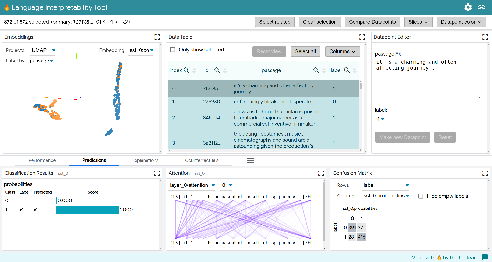

# Language Interpretability Tool (LIT) :fire:

The Language Interpretability Tool (LIT) is a visual, interactive
model-understanding tool for NLP models.

LIT is built to answer questions such as:

*   **What kind of examples** does my model perform poorly on?
*   **Why did my model make this prediction?** Can this prediction be attributed
    to adversarial behavior, or to undesirable priors in the training set?
*   **Does my model behave consistently** if I change things like textual style,
    verb tense, or pronoun gender?



LIT supports a variety of debugging workflows through a browser-based UI.
Features include:

*   **Local explanations** via salience maps, attention, and rich visualization
    of model predictions.
*   **Aggregate analysis** including custom metrics, slicing and binning, and
    visualization of embedding spaces.
*   **Counterfactual generation** via manual edits or generator plug-ins to
    dynamically create and evaluate new examples.
*   **Side-by-side mode** to compare two or more models, or one model on a pair
    of examples.
*   **Highly extensible** to new model types, including classification,
    regression, span labeling, seq2seq, and language modeling. Supports
    multi-head models and multiple input features out of the box.
*   **Framework-agnostic** and compatible with TensorFlow, PyTorch, and more.

For a broader overview, check out [our paper](TBD) and the
[user guide](docs/user_guide.md).

## Getting Started

Download the repo and set up a Python environment:

```sh
git clone https://github.com/PAIR-code/lit.git ~/lit
cd ~/lit
conda env create -f environment.yml
conda activate lit-nlp
```

Build the frontend (output will be in `~/lit/client/build`). You only need to do
this once, unless you change the TypeScript or CSS files.

```sh
cd ~/lit/lit_nlp/client
yarn  # install deps
yarn build --watch
```

And run a LIT server, such as those included in
../lit_nlp/examples:

```sh
cd ~/lit
python -m lit_nlp.examples.pretrained_lm_demo --models=bert-base-uncased \
  --port=5432
```

You can then access the LIT UI at http://localhost:5432.

## Full Documentation

[Click here for the full documentation site.](docs/index.md)

To learn about the features of the tool as an end-user, check out the
[user guide](docs/user_guide.md).

You can easily run LIT with your own model by creating a custom `demo.py`
launcher, similar to those in ../lit_nlp/examples. For a full
walkthrough, see
[adding models and data](docs/python_api.md#adding-models-and-data).


LIT is easy to extend with new interpretability components, generators, and
more, both on the frontend or the backend. See the
[developer guide](docs/development.md) to get started.

## Citing LIT

If you use LIT as part of your work, please cite:

TODO: add BibTeX here once we're on arXiv

## Disclaimer

This is not an official Google product.
