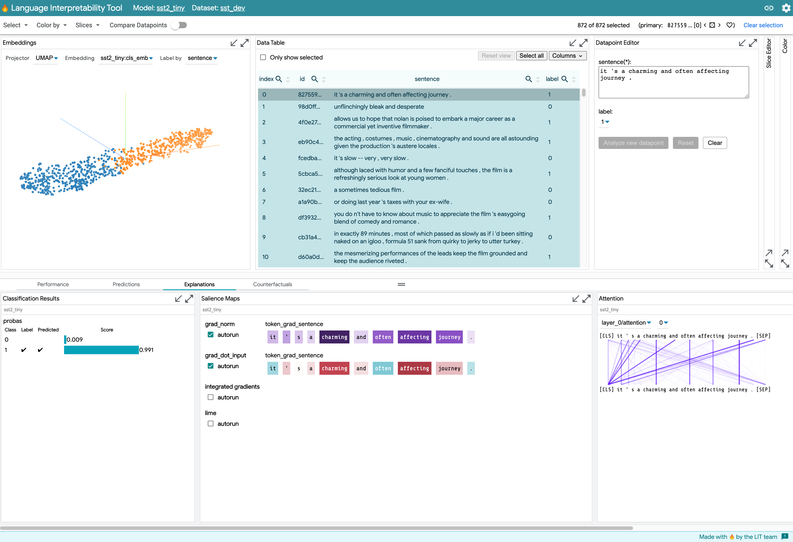

# 🔥 Learning Interpretability Tool (LIT)

<!--* freshness: { owner: 'lit-dev' reviewed: '2022-11-15' } *-->

The Learning Interpretability Tool (🔥LIT, formerly known as the Language
Interpretability Tool) is a visual, interactive ML model-understanding tool that
supports text, image, and tabular data. It can be run as a standalone server, or
inside of notebook environments such as Colab, Jupyter, and Google Cloud Vertex
AI notebooks.

LIT is built to answer questions such as:

*   **What kind of examples** does my model perform poorly on?
*   **Why did my model make this prediction?** Can this prediction be attributed
    to adversarial behavior, or to undesirable priors in the training set?
*   **Does my model behave consistently** if I change things like textual style,
    verb tense, or pronoun gender?



LIT supports a variety of debugging workflows through a browser-based UI.
Features include:

*   **Local explanations** via salience maps, attention, and rich visualization
    of model predictions.
*   **Aggregate analysis** including custom metrics, slicing and binning, and
    visualization of embedding spaces.
*   **Counterfactual generation** via manual edits or generator plug-ins to
    dynamically create and evaluate new examples.
*   **Side-by-side mode** to compare two or more models, or one model on a pair
    of examples.
*   **Highly extensible** to new model types, including classification,
    regression, span labeling, seq2seq, and language modeling. Supports
    multi-head models and multiple input features out of the box.
*   **Framework-agnostic** and compatible with TensorFlow, PyTorch, and more.

LIT has a [website](https://pair-code.github.io/lit) with live demos, tutorials,
a setup guide and more.

Stay up to date on LIT by joining the
[lit-announcements mailing list](https://groups.google.com/g/lit-annoucements).

For a broader overview, check out [our paper](https://arxiv.org/abs/2008.05122) and the
[user guide](https://github.com/PAIR-code/lit/wiki/ui_guide.md).

## Documentation

*   [Documentation index](https://github.com/PAIR-code/lit/wiki)
*   [FAQ](https://github.com/PAIR-code/lit/wiki/faq.md)
*   [Release notes](./RELEASE.md)

## Download and Installation

LIT can be installed via `pip` or built from source. Building from source is
necessary if you update any of the front-end or core back-end code.

### Install from source

Clone the repo and set up a Python environment:

```sh
git clone https://github.com/PAIR-code/lit.git ~/lit

# Set up Python environment
cd ~/lit
conda env create -f environment.yml
conda activate lit-nlp
conda install cudnn cupti  # optional, for GPU support
conda install -c pytorch pytorch  # optional, for PyTorch

# Build the frontend
(cd lit_nlp; yarn && yarn build)
```

Note: if you see [an error](https://github.com/yarnpkg/yarn/issues/2821)
running `yarn` on Ubuntu/Debian, be sure you have the
[correct version installed](https://yarnpkg.com/en/docs/install#linux-tab).

### pip installation

```sh
pip install lit-nlp
```

The `pip` installation will install all necessary prerequisite packages for use
of the core LIT package.

It **does not** install the prerequisites for the provided demos, so you need to
install those yourself. See [environment.yml](./environment.yml) for the list of
packages required to run the demos.

## Running LIT

Explore a collection of hosted demos on the
[LIT website demos page](https://pair-code.github.io/lit/demos).

### Quick-start: classification and regression

To explore classification and regression models tasks from the popular
[GLUE benchmark](https://gluebenchmark.com/):

```sh
python -m lit_nlp.examples.glue_demo --port=5432 --quickstart
```

Navigate to http://localhost:5432 to access the LIT UI.

Your default view will be a
[small BERT-based model](https://arxiv.org/abs/1908.08962) fine-tuned on the
[Stanford Sentiment Treebank](https://nlp.stanford.edu/sentiment/treebank.html),
but you can switch to
[STS-B](http://ixa2.si.ehu.es/stswiki/index.php/STSbenchmark) or
[MultiNLI](https://cims.nyu.edu/~sbowman/multinli/) using the toolbar or the
gear icon in the upper right.

### Quick-start: language modeling

To explore predictions from a pre-trained language model (BERT or GPT-2), run:

```sh
python -m lit_nlp.examples.lm_demo --models=bert-base-uncased --port=5432
```

And navigate to http://localhost:5432 for the UI.

### Notebook usage

Colab notebooks showing the use of LIT inside of notebooks can be found at
google3/third_party/py/lit_nlp/examples/notebooks.

We provide a simple
[Colab demo](https://colab.research.google.com/github/PAIR-code/lit/blob/main/lit_nlp/examples/notebooks/LIT_sentiment_classifier.ipynb).
Run all the cells to see LIT on an example classification model in the notebook.

### Run LIT in a Docker container

LIT can be run as a containerized app using [Docker](https://www.docker.com/) or
your preferred engine. Use the following shell commands to build the default
Docker image for LIT from the provided `Dockerfile`, and then run a container
from that image. Comments are provided in-line to help explain each step.

```shell
# Build the docker image using the -t argument to name the image. Remember to
# include the trailing . so Docker knows where to look for the Dockerfile
docker build -t lit_app .

# Now you can run LIT as a containerized app using the following command. Note
# that the last parameter to the run command is the value you passed to the -t
# argument in the build command above.
docker run --rm -p 5432:5432 lit-app
```

The image above defaults to launching the GLUE demo on port 5432, but you can
override this using environment variables. See our
[advanced guide](https://github.com/PAIR-code/lit/wiki/docker.md) for detailed instructions on using the default
LIT Docker image, running LIT as a containerized web app in different scenarios,
and how to creating your own LIT images.

### More Examples

See [lit_nlp/examples](./lit_nlp/examples). Run similarly to the above:

```sh
python -m lit_nlp.examples.<example_name> --port=5432 [optional --args]
```

## User Guide

To learn about LIT's features, check out the [user guide](https://github.com/PAIR-code/lit/wiki/ui_guide.md), or
watch this [video](https://www.youtube.com/watch?v=CuRI_VK83dU).

## Adding your own models or data

You can easily run LIT with your own model by creating a custom `demo.py`
launcher, similar to those in [lit_nlp/examples](./lit_nlp/examples). The
basic steps are:

*   Write a data loader which follows the [`Dataset` API](https://github.com/PAIR-code/lit/wiki/api.md#datasets)
*   Write a model wrapper which follows the [`Model` API](https://github.com/PAIR-code/lit/wiki/api.md#models)
*   Pass models, datasets, and any additional
    [components](https://github.com/PAIR-code/lit/wiki/api.md#interpretation-components) to the LIT server class

For a full walkthrough, see
[adding models and data](https://github.com/PAIR-code/lit/wiki/api.md#adding-models-and-data).

## Extending LIT with new components

LIT is easy to extend with new interpretability components, generators, and
more, both on the frontend or the backend. See our [documentation](https://github.com/PAIR-code/lit/wiki) to get
started.

## Pull Request Process

To make code changes to LIT, please work off of the `dev` branch and
[create pull requests](https://docs.github.com/en/pull-requests/collaborating-with-pull-requests/proposing-changes-to-your-work-with-pull-requests/creating-a-pull-request)
(PRs) against that branch. The `main` branch is for stable releases, and it is
expected that the `dev` branch will always be ahead of `main`.

[Draft PRs](https://github.blog/2019-02-14-introducing-draft-pull-requests/) are
encouraged, especially for first-time contributors or contributors working on
complex tasks (e.g., Google Summer of Code contributors). Please use these to
communicate ideas and implementations with the LIT team, in addition to issues.

Prior to sending your PR or marking a Draft PR as "Ready for Review", please run
the Python and TypeScript linters on your code to ensure compliance with
Google's [Python](https://google.github.io/styleguide/pyguide.html) and
[TypeScript](https://google.github.io/styleguide/tsguide.html) Style Guides.

```sh
# Run Pylint on your code using the following command from the root of this repo
pushd lit_nlp & pylint & popd

# Run ESLint on your code using the following command from the root of this repo
pushd lit_nlp & yarn lint & popd
```

## Citing LIT

If you use LIT as part of your work, please cite
[our EMNLP paper](https://arxiv.org/abs/2008.05122):

```
@misc{tenney2020language,
    title={The Language Interpretability Tool: Extensible, Interactive Visualizations and Analysis for {NLP} Models},
    author={Ian Tenney and James Wexler and Jasmijn Bastings and Tolga Bolukbasi and Andy Coenen and Sebastian Gehrmann and Ellen Jiang and Mahima Pushkarna and Carey Radebaugh and Emily Reif and Ann Yuan},
    booktitle = "Proceedings of the 2020 Conference on Empirical Methods in Natural Language Processing: System Demonstrations",
    year = "2020",
    publisher = "Association for Computational Linguistics",
    pages = "107--118",
    url = "https://www.aclweb.org/anthology/2020.emnlp-demos.15",
}
```

## Disclaimer

This is not an official Google product.

LIT is a research project and under active development by a small team. There
will be some bugs and rough edges, but we're releasing at an early stage because
we think it's pretty useful already. We want LIT to be an open platform, not a
walled garden, and we would love your suggestions and feedback - drop us a line
in the [issues](https://github.com/pair-code/lit/issues).
