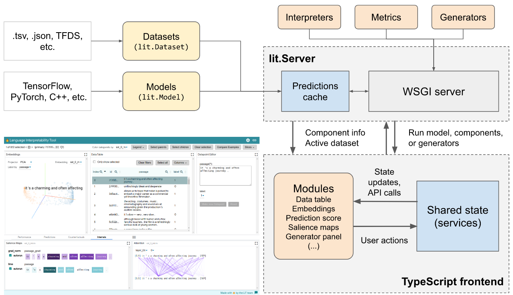

# Developer Guide


<!--* freshness: { owner: 'lit-dev' reviewed: '2020-08-04' } *-->


For specific API documentation, see:

*   [Python API](python_api.md)
*   [Frontend Client](client.md)

## Design Overview



LIT consists of a Python backend and a TypeScript frontend. The backend serves
models, data, and interpretation components, each of which is a Python class
implementing a [minimal API](python_api.md) and relying on the
[spec system](#type-system) to detect fields and verify compatibility. The
server is stateless, but implements a caching layer for model predictions - this
simplifies component design and allows interactive use of large models like
BERT. The backend is easily extensible by adding new components; see the
[Python API guide](python_api.md) for more details.

The frontend is a stateful single-page app, built using
[lit-element](https://lit-element.polymer-project.org/)[^1] for modularity and
[MobX](https://mobx.js.org/) for state management. It consists of a core UI
framework, a set of shared "services" which manage persistent state, and a set
of independent modules which render visualizations and support user interaction.
For more details, see the [frontend client guide](client.md).

Typically, a user will load LIT as a Python library, pass their models and data
to the server, and start the web app which they can then interact with via a
browser:

```python
models = {'foo': FooModel(...),
          'bar': BarModel(...)}
datasets = {'baz': BazDataset(...)}
server = lit_nlp.dev_server.Server(models, datasets, port=4321)
server.serve()
```

For more, see [adding models and data](python_api.md#adding-models-and-data) or
the examples in ../lit_nlp/examples.

[^1]: Naming is just a happy coincidence; the Language Interpretability Tool is
    not related to the lit-html or lit-element projects.

## Type System

Input examples and model outputs in LIT are flat records (i.e. Python `dict` and
JavaScript `object`). Field names (keys) are user-specified strings, and we use
a system of "specs" to describe the types of the values. This spec system is
semantic: in addition to defining the datatype (string, float, etc.), spec types
define how a field should be interpreted by LIT components and frontend modules.

For example, the [MultiNLI](https://cims.nyu.edu/~sbowman/multinli/) dataset
might define the following spec:

```python
# dataset.spec()
{
  "premise": lit_types.TextSegment(),
  "hypothesis": lit_types.TextSegment(),
  "label": lit_types.CategoryLabel(vocab=["entailment", "neutral", "contradiction"]),
  "genre": lit_types.CategoryLabel(),
}
```

for which an example record might be

```python
# dataset.examples[0]
{
  "premise": "Buffet and a la carte available.",
  "hypothesis": "It has a buffet."
  "label": "entailment",
  "genre": "travel",
}
```

A classifier for this task might have the following input spec, matching a
subset of the dataset fields:

```python
# model.input_spec()
{
  "premise": lit_types.TextSegment(),
  "hypothesis": lit_types.TextSegment(),
}
```

And the output spec:

```python
# model.output_spec()
{
  "probas": lit_types.MulticlassPreds(
        parent="label",
        vocab=["entailment", "neutral", "contradiction"]),
}
```

for which example predictions might be:

```python
# model.predict([dataset.examples[0]])[0]
{
  "probas": [0.967, 0.024, 0.009],
}
```

_For a more detailed example, see ../lit_nlp/examples._

LIT components use this spec to find and operate on relevant fields, as well as
to access metadata like label vocabularies. For example, the multiclass metrics
module will recognize the `MulticlassPreds` field in the output, use the `vocab`
annotation to decode to string labels, and evaluate these against the input
field described by the `parent` annotation.

This spec system allows LIT to be flexible and extensible in model support.
Multiple input segments - such as for NLI or QA - are easily supported by
defining multiple `TextSegment` fields as in the above example, while
multi-headed models can simply define multiple output fields. Furthermore, new
types can easily be added to support custom input modalities, output types, or
to provide access to model internals. For a more detailed example, see the
[`Model` documentation](python_api#models).

The actual spec types, such as `MulticlassLabel`, are simple dataclasses (built
using [`attr.s`](https://www.attrs.org/en/stable/). They are defined in Python,
but are available in the [TypeScript client](client.md) as well.

[`utils.find_spec_keys()`](../lit_nlp/lib/utils.py)
(Python) and
[`findSpecKeys()`](../lit_nlp/client/lib/utils.ts)
(TypeScript) are commonly used to interact with a full spec and identify fields
of interest. These recognize subclasses: for example,
`utils.find_spec_keys(spec, Scalar)` will also match any `RegressionScore`
fields.

### Available types

The full set of spec types is defined in
[types.py](../lit_nlp/api/types.py), and summarized
in the table below.

_Note: bracket syntax like `<float>[num_tokens]` refers to the shapes of NumPy
arrays._

Name              | Description                                                                                                                                                           | Data type
----------------- | --------------------------------------------------------------------------------------------------------------------------------------------------------------------- | ---------
`TextSegment`     | Untokenized (raw) text.                                                                                                                                               | `string`
`GeneratedText`   | Generated text (untokenized).                                                                                                                                         | `string`
`Tokens`          | Tokenized text.                                                                                                                                                       | `List[string]`
`TokenTopKPreds`  | Predicted tokens and their scores, as from a language model or seq2seq model.                                                                                         | `List[List[Tuple[string, float]]]`
`Scalar`          | Scalar numeric value.                                                                                                                                                 | `float`
`RegressionScore` | Scalar value, treated as a regression target or prediction.                                                                                                           | `float`
`CategoryLabel`   | Categorical label, from open or fixed vocabulary.                                                                                                                     | `string`
`MulticlassPreds` | Multiclass predicted probabilities.                                                                                                                                   | `<float>[num_labels]`
`SequenceTags`    | Sequence tags, aligned to tokens.                                                                                                                                     | `List[string]`
`SpanLabels`      | Span labels, aligned to tokens. Each label is (i,j,label).                                                                                                            | `List[SpanLabel]`
`EdgeLabels`      | Edge labels, aligned to tokens. This is a general way to represent many structured prediction tasks, such as coreference or SRL. See https://arxiv.org/abs/1905.06316 | `List[EdgeLabel]`
`Embeddings`      | Fixed-length embeddings or model activations.                                                                                                                         | `<float>[emb_dim]`
`TokenGradients`  | Gradients with respect to input token embeddings.                                                                                                                     | `<float>[num_tokens, emb_dim]`
`AttentionHeads`  | Attention heads, grouped by layer.                                                                                                                                    | `<float>[num_heads, num_tokens, num_tokens]`

Values can be plain data, NumPy arrays, or custom dataclasses - see
[dtypes.py](../lit_nlp/api/dtypes.py) and
[serialize.py](../lit_nlp/api/serialize.py) for
further detail.
