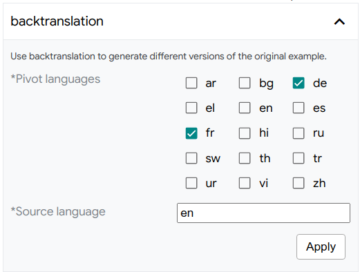

# LIT Python API

<!--* freshness: { owner: 'lit-dev' reviewed: '2022-11-16' } *-->

<!-- [TOC] placeholder - DO NOT REMOVE -->

## Design Overview

LIT is a modular system, comprising a collection of backend components (written
in Python) and frontend modules (written in TypeScript). Most users will develop
against the Python API, which is documented below and allows LIT to be extended
with custom models, datasets, metrics, counterfactual generators, and more. The
LIT server and components are provided as a library which users can use through
their own demo binaries or via Colab.

The components can also be used as regular Python classes without starting a
server; see [below](#using-components-outside-lit) for details.


The LIT backend serves models, data, and interpretability components, each of
which is a Python class implementing a minimal API and relying on the
[spec system](#type-system) to detect fields and verify compatibility. The
server is stateless, but implements a caching layer for model predictions - this
simplifies component design and allows interactive use of large models like BERT
or T5.

The frontend is a stateful single-page app, built using
[Lit](https://lit.dev/)[^1] for modularity and [MobX](https://mobx.js.org/) for
state management. It consists of a core UI framework, a set of shared "services"
which manage persistent state, and a set of independent modules which render
visualizations and support user interaction. For more details, see the
[UI guide](./ui_guide.md) and the 
[frontend developer guide](./frontend_development.md).

[^1]: Naming is just a happy coincidence; the Learning Interpretability Tool is
      not related to the Lit projects.

## Adding Models and Data

To run LIT with your own models and data, you can create a custom `demo.py`
script that passes these to the LIT server. For example:

```py
def main(_):
  # MulitiNLIData implements the Dataset API
  datasets = {
      'mnli_matched': MultiNLIData('/path/to/dev_matched.tsv'),
      'mnli_mismatched': MultiNLIData('/path/to/dev_mismatched.tsv'),
  }

  # NLIModel implements the Model API
  models = {
      'model_foo': NLIModel('/path/to/model/foo/files'),
      'model_bar': NLIModel('/path/to/model/bar/files'),
  }

  lit_demo = lit_nlp.dev_server.Server(models, datasets, port=4321)
  lit_demo.serve()

if __name__ == '__main__':
  main()
```

Conceptually, a dataset is just a list of examples and a model is just a
function that takes examples and returns predictions. The [`Dataset`](#datasets)
and [`Model`](#models) classes implement this, and provide metadata (see the
[type system](#type-system)) to describe themselves to other components.

For pre-built `demo.py` examples, check out
https://github.com/PAIR-code/lit/tree/main/lit_nlp/examples

### Validating Models and Data

Datasets and models can optionally be validated by LIT to ensure that dataset
examples match their spec and that model output values match their spec.
This can be very helpful during development of new model and dataset wrappers
to ensure correct behavior in LIT.

At LIT server startup, the `validate` flag can be used to enable validation.
There are three modes:

*   `--validate=first` will check the first example in each dataset.
*   `--validate=sample` will validate a sample of 5% of each dataset.
*   `--validate=all` will run validation on all examples from all datasets.

Additionally, if using LIT datasets and models outside of the LIT server,
validation can be called directly through the
[`validation`](../lit_nlp/lib/validation.py) module.

## Datasets

Datasets ([`Dataset`](../lit_nlp/api/dataset.py)) are
just a list of examples, with associated type information following LIT's
[type system](#type-system).

*   `spec()` should return a flat dict that describes the fields in each example
*   `self._examples` should be a list of flat dicts

LIT operates on all examples loaded in the datasets you include in your LIT
server, therefore you should take care to use dataset sizes that can fit into
memory on your backend server and can be displayed in the browser.

NOTE: See the [FAQ](./faq.md) for more details on dataset size limitations.

Implementations should subclass
[`Dataset`](../lit_nlp/api/dataset.py). Usually this
is just a few lines of code - for example, the following is a complete
implementation for the [MultiNLI](https://cims.nyu.edu/~sbowman/multinli/)
dataset:

```py
class MultiNLIData(Dataset):
  """Loader for MultiNLI development set."""

  NLI_LABELS = ['entailment', 'neutral', 'contradiction']

  def __init__(self, path):
    # Read the eval set from a .tsv file as distributed with the GLUE benchmark.
    df = pandas.read_csv(path, sep='\t')
    # Store as a list of dicts, conforming to self.spec()
    self._examples = [{
      'premise': row['sentence1'],
      'hypothesis': row['sentence2'],
      'label': row['gold_label'],
      'genre': row['genre'],
    } for _, row in df.iterrows()]

  def spec(self):
    return {
      'premise': lit_types.TextSegment(),
      'hypothesis': lit_types.TextSegment(),
      'label': lit_types.CategoryLabel(vocab=self.NLI_LABELS),
      # We can include additional fields, which don't have to be used by the model.
      'genre': lit_types.CategoryLabel(),
    }
```

In this example, all four fields (premise, hypothesis, label, and genre) have
string values, but the [semantic types](#type-system) tell LIT a bit more about
how to interpret them:

*   `premise` and `hypothesis` should be treated as natural-language text
    (`TextSegment`)
*   `label` should be treated as a categorical feature (`CategoryLabel`) with a
    fixed, known set of possible values (`vocab=self.NLI_LABELS`)
*   `genre` should be treated as a categorical feature, but with an unknown or
    open set of values.

This implementation uses Pandas to read a TSV file, but you can also use
services like [TensorFlow Datasets](https://www.tensorflow.org/datasets) -
simply wrap them in your `__init__()` function.

Note that you can freely add additional features - such as `genre` in the
example above - which the model may not be aware of. The LIT UI will recognize
these features for slicing, binning, etc., and they will also be available to
interpretation components such as custom metrics.

### Transformations

The `Dataset` class also supports a limited set of transformations, similar to
TensorFlow's
[tf.data.Dataset](https://www.tensorflow.org/api_docs/python/tf/data/Dataset)
but more limited in scope and aimed at supporting quick iteration:

*   `Dataset.slice[start:step:end]` will return a new `Dataset` with the same
    spec and a slice of the datapoints.
*   `Dataset.sample(n, seed=42)` will return a new `Dataset` with the same spec
    and a random sample of the datapoints.
*   `Dataset.remap(field_map: Dict[str, str])` will return a new `Dataset` with
    renamed fields in both the examples and spec.

The latter is a shortcut to use datasets matching one model with another; for
example, a dataset with a `"document"` field can be used with a model expecting
a `"text"` input via `Dataset.remap({"document":
"text"})`.[^why-not-standardize-names]

[^why-not-standardize-names]: We could solve this particular case by
    standardizing names, but one still needs to be
    explicit if there are multiple segments available,
    such as `"question"` and `"document"` for a QA
    task.

## Models

Models ([`Model`](../lit_nlp/api/model.py)) are
functions which take inputs and produce outputs, with associated type
information following LIT's [type system](#type-system). The core API consists
of three methods:

*   `input_spec()` should return a flat dict that describes necessary input
    fields
*   `output_spec()` should return a flat dict that describes the model's
    predictions and any additional outputs
*   `predict_minibatch()` and/or `predict()` should take a sequence of inputs
    (satisfying `input_spec()`) and yields a parallel sequence of outputs
    matching `output_spec()`.

Implementations should subclass
[`Model`](../lit_nlp/api/model.py). An example for
[MultiNLI](https://cims.nyu.edu/~sbowman/multinli/) might look something like:

```py
class NLIModel(Model):
  """Wrapper for a Natural Language Inference model."""

  NLI_LABELS = ['entailment', 'neutral', 'contradiction']

  def __init__(self, model_path, **kw):
    # Load the model into memory so we're ready for interactive use.
    self._model = _load_my_model(model_path, **kw)

  ##
  # LIT API implementations
  def predict(self, inputs: Iterable[Input]) -> Iterator[Preds]:
    """Predict on a stream of examples."""
    examples = [self._model.convert_dict_input(d) for d in inputs]  # any custom preprocessing
    return self._model.predict_examples(examples)  # returns a dict for each input

  def input_spec(self):
    """Describe the inputs to the model."""
    return {
        'premise': lit_types.TextSegment(),
        'hypothesis': lit_types.TextSegment(),
    }

  def output_spec(self):
    """Describe the model outputs."""
    return {
      # The 'parent' keyword tells LIT where to look for gold labels when computing metrics.
      'probas': lit_types.MulticlassPreds(vocab=NLI_LABELS, parent='label'),
    }
```

Unlike the dataset example, this model implementation is incomplete - you'll
need to customize `predict()` (or `predict_minibatch()`) accordingly with any
pre- or post-processing needed, such as tokenization.

Note: The `Model` base class implements simple batching, aided by the
`max_minibatch_size()` function. This is purely for convenience, since most deep
learning models will want this behavior. But if you don't need it, you can
simply override the `predict()` function directly and handle large inputs
accordingly.

Note: there are a few additional methods in the model API - see
[`Model`](../lit_nlp/api/model.py) for details.

If your model is on a remote server, consider using the `BatchedRemoteModel`
base class, which implements parallel batched requests using a thread pool.

### Adding more outputs

The above example defined a black-box model, with predictions but no access to
internals. If we want a richer view into the model's behavior, we can add
additional return fields corresponding to hidden-state activations, gradients,
word embeddings, attention, or more. For example, a BERT-based model with
several such features might have the following `output_spec()`:

```py
  def output_spec(self):
    """Describe the model outputs."""
    return {
      # The 'parent' keyword tells LIT where to look for gold labels when computing metrics.
      'probas': lit_types.MulticlassPreds(vocab=NLI_LABELS, parent='label'),
      # This model returns two different embeddings (activation vectors), but you can easily add more.
      'output_embs': lit_types.Embeddings(),      # from [CLS] token at top layer
      'mean_word_embs':  lit_types.Embeddings(),  # mean of input word embeddings
      # In LIT, we treat tokens as another model output. There can be more than one,
      # and the 'parent' field describes which input segment they correspond to.
      'premise_tokens': lit_types.Tokens(parent='premise'),
      'hypothesis_tokens': lit_types.Tokens(parent='hypothesis'),
      # Gradients are also returned by the model; 'align' here references a Tokens field.
      'premise_grad': lit_types.TokenGradients(align='premise_tokens'),
      'hypothesis_grad': lit_types.TokenGradients(align='hypothesis_tokens'),
      # Similarly, attention references a token field, but here we want the model's full "internal"
      # tokenization, which might be something like: [START] foo bar baz [SEP] spam eggs [END]
      'tokens': lit_types.Tokens(),
      'attention_layer0': lit_types.AttentionHeads(align=['tokens', 'tokens']),
      'attention_layer1': lit_types.AttentionHeads(align=['tokens', 'tokens']),
      'attention_layer2': lit_types.AttentionHeads(align=['tokens', 'tokens']),
      # ...and so on. Since the spec is just a dictionary of dataclasses, you can populate it
      # in a loop if you have many similar fields.
    }
```

The `predict()` function would return, for each example, additional dict entries
corresponding to each of these fields.

Note: Because tokenization is often tightly coupled with the model code, we
treat it as an intermediate state on the same level as embeddings or attention,
and thus return `Tokens` as a field in the model *output*. This also allows
models to expose different tokenizations for different inputs, such as
`premise_tokens` and `hypothesis_tokens` above.

LIT components and frontend modules will automatically detect these spec fields
and use them to support additional interpretation methods, such as the embedding
projector or gradient-based salience maps.

You can also implement multi-headed models this way: simply add additional
output fields for each prediction (such as another `MulticlassPreds`), and
they'll be automatically detected.

See the [type system documentation](#type-system) for more details on available
types and their semantics.

### Optional inputs

By default, LIT treats `input_spec` fields as required. However, this can be set
to false if you wish to define optional model inputs. For example, a model that
can accept pre-tokenized inputs might have the following spec:

```python
    def input_spec(self):
      return {
          "text": lit_types.TextSegment(),
          "tokens": lit_types.Tokens(parent='text', required=False),
      }
```

And in the model's `predict()` or `predict_minibatch()`, you would have logic to
use these and bypass the tokenizer:

```python
    def predict_minibatch(inputs):
      input_tokens = [ex.get('tokens') or self.tokenizer.tokenize(ex['text'])
                      for ex in inputs]
      # ...rest of your predict logic...
```

`required=False` can also be used for label fields (such as `"label":
lit_types.CategoryLabel(required=False)`), though these can also be omitted from
the input spec entirely if they are not needed to compute model outputs.

## UI Layouts

You can also specify one or more custom layouts for the frontend UI. To do this,
pass a dict of `LitCanonicalLayout` objects in `layouts=` when initializing the
server. These objects represent a tabbed layout of modules, such as:

```python
LM_LAYOUT = layout.LitCanonicalLayout(
    upper={
        "Main": [
            modules.EmbeddingsModule,
            modules.DataTableModule,
            modules.DatapointEditorModule,
        ]
    },
    lower={
        "Predictions": [
            modules.LanguageModelPredictionModule,
            modules.ConfusionMatrixModule,
        ],
        "Counterfactuals": [modules.GeneratorModule],
    },
    description="Custom layout for language models.",
)
```

You can pass this to the server as:

```python
lit_demo = dev_server.Server(
    models,
    datasets,
    # other args...
    layouts={"lm": LM_LAYOUT},
    **server_flags.get_flags())
return lit_demo.serve()
```

For a full example, see
[`lm_demo.py`](../lit_nlp/examples/lm_demo.py) You
can see the default layouts as well as the list of available modules in
[`layout.py`](../lit_nlp/api/layout.py).

To use a specific layout for a given LIT instance, pass the key (e.g., "simple"
or "default" or the name of a custom layout defined in Python) as a server flag
when initializing LIT (`--default_layout=<layout>`). Commonly, this is done
using `FLAGS.set_default('default_layout', 'my_layout_name')`. The layout can
also be set on-the-fly the `layout=` URL param, which will take precedence.

## Interpretation Components

Backend interpretation components include metrics, salience maps, visualization
aids like [UMAP](https://umap-learn.readthedocs.io/en/latest/), and
counterfactual generator plug-ins.

Most such components implement the
[`Interpreter`](../lit_nlp/api/components.py) API.
Conceptually, this is any function that takes a set of datapoints and a model,
and produces some output.[^identity-component] For example,
[local gradient-based salience (GradientNorm)](../lit_nlp/components/gradient_maps.py)
processes the `TokenGradients` and `Tokens` returned by a model and produces a
list of scores for each token. The Integrated Gradients saliency method
additionally requires a `TokenEmbeddings` input and corresponding output, as
well as a label field `Target` to pin the gradient target to the same class as
an input and corresponding output. See the
[GLUE models class](../lit_nlp/examples/models/glue_models.py)
for an example of these spec requirements.

The core API involves implementing the `run()` method:

```python
  def run(self,
          inputs: List[JsonDict],
          model: lit_model.Model,
          dataset: lit_dataset.Dataset,
          model_outputs: Optional[List[JsonDict]] = None,
          config: Optional[JsonDict] = None):
    # config is any runtime options to this component, such as a threshold for
    # (binary) classification metrics.
```

Note: a more general `run_with_metadata()` method is also available; this
receives a list of `IndexedInput` which contain additional metadata, such as
parent pointers for tracking counterfactuals.

Output from an interpreter component is unconstrained; it's up to the frontend
component requesting it to process the output correctly. In particular, some
components (such as salience maps) may operate on each example independently,
similar to model predictions, while others (such as metrics) may produce
aggregate summaries of the input set.

Interpreters are also responsible for verifying compatibility by reading the
model and dataset specs; these are also used to determine what fields to operate
on. A typical implementation just loops over the relevant specs. For example,
for
[simple gradient-based salience](../lit_nlp/components/gradient_maps.py)
we might have:

```python
  def find_fields(self, output_spec: Spec) -> List[Text]:
    # Find TokenGradients fields
    grad_fields = utils.find_spec_keys(output_spec, types.TokenGradients)

    # Check that these are aligned to Tokens fields
    for f in grad_fields:
      tokens_field = output_spec[f].align  # pytype: disable=attribute-error
      assert tokens_field in output_spec
      assert isinstance(output_spec[tokens_field], types.Tokens)
    return grad_fields

  def run(self,
          inputs: List[JsonDict],
          model: lit_model.Model,
          dataset: lit_dataset.Dataset,
          model_outputs: Optional[List[JsonDict]] = None,
          config: Optional[JsonDict] = None) -> Optional[List[JsonDict]]:
    """Run this component, given a model and input(s)."""
    # Find gradient fields to interpret
    output_spec = model.output_spec()
    grad_fields = self.find_fields(output_spec)
    logging.info('Found fields for gradient attribution: %s', str(grad_fields))
    if len(grad_fields) == 0:  # pylint: disable=g-explicit-length-test
      return None

    # do rest of the work to create the salience maps for each available field

    # return a dtypes.TokenSalience for each input, which has a list of
    # tokens (from the model) and their associated scores.
```

This design adds some code overhead to interpretation components, but the
benefit is flexibility - Python can be used to specify complex dependencies
between fields, and multiple outputs can be easily supported in a loop.

[^identity-component]: A trivial one might just run the model and return
    predictions, though in practice we have a separate
    endpoint for that.

### Metrics

For metrics, the
[`SimpleMetrics`](../lit_nlp/components/metrics.py)
class implements the spec-matching and input-unpacking logic to satisfy the
general `Interpreter` API. A subclass of `SimpleMetrics` should implement an
`is_compatible()` method and a `compute()` method, which is called on compatible
(prediction, label) pairs and returns a dict of named score fields. For example:

```python
class RegressionMetrics(SimpleMetrics):
  """Standard regression metrics."""

  def is_compatible(self, field_spec: types.LitType) -> bool:
    """Return true if compatible with this field."""
    return isinstance(field_spec, types.RegressionScore)

  def compute(self,
              labels: Sequence[float],
              preds: Sequence[float],
              label_spec: types.Scalar,
              pred_spec: types.RegressionScore,
              config: Optional[JsonDict] = None) -> Dict[Text, float]:
    """Compute metric(s) between labels and predictions."""
    del config
    mse = sklearn_metrics.mean_squared_error(labels, preds)
    pearsonr = scipy_stats.pearsonr(labels, preds)[0]
    spearmanr = scipy_stats.spearmanr(labels, preds)[0]
    return {'mse': mse, 'pearsonr': pearsonr, 'spearmanr': spearmanr}
```

The implementation of `SimpleMetrics.run()` uses the `parent` key (see
[type system](#type-system)) in fields of the model's output spec to find the
appropriate input fields to compare against, and calls `compute()` accordingly
on the unpacked values.

### Generators

Conceptually, a generator is just an interpreter that returns new input
examples. These may depend on the input only, as for techniques such as back-
translation, or can involve feedback from the model, such as for adversarial
attacks.

The core generator API is:

```python
class Generator(Interpreter):
  """Base class for LIT generators."""

  def generate_all(self,
                   inputs: List[JsonDict],
                   model: lit_model.Model,
                   dataset: lit_dataset.Dataset,
                   config: Optional[JsonDict] = None) -> List[List[JsonDict]]:
    """Run generation on a set of inputs.

    Args:
      inputs: sequence of inputs, following model.input_spec()
      model: optional model to use to generate new examples.
      dataset: optional dataset which the current examples belong to.
      config: optional runtime config.

    Returns:
      list of list of new generated inputs, following model.input_spec()
    """
```

Where the output is a list of lists: a set of generated examples for each input.
For convenience, there is also a `generate()` method which takes a single
example and returns a single list; we provide the more general `generate_all()`
API to support model-based generators (such as back-translation) which benefit
from batched requests.

As with other interpreter components, a generator can take custom arguments
through `config`, such as the list of substitutions for the
[word replacer](../lit_nlp/components/word_replacer.py).

#### Backtranslator Generator

The [backtranslator](../lit_nlp/components/backtranslator.py)
generator translates text segment inputs into foreign languages and back to the
source language in order to create paraphrases.
It relies on the Google Cloud Translate API to perform those translations.
To use it, you must have a Google Cloud project and set up Cloud Translation
as described at https://cloud.google.com/translate/docs/setup.
Then, download  your application credentials file locally and set the
GOOGLE_APPLICATION_CREDENTIALS environment variable to point to that file.
With that environment variable set to the correct path, LIT can make use of the
backtranlator generator if you pass it as a generator in the Server constructor.

### Configuration UI

Interpreter components support an optional `config` option to specify run-time
options, such as the number of samples for LIME or the pivot languages for
back-translation. LIT provides a simple DSL to define these options, which will
auto-generate a form on the frontend. The DSL uses the same
[type system](#type-system) as used to define data and model outputs, and the
`config` argument will be passed a dict with the form values.

For example, the following spec:

```python
  def config_spec(self) -> types.Spec:
    return {
        "Pivot languages": types.SparseMultilabel(
            vocab=['ar', 'bg', 'de', 'el', 'en', 'es', 'fr', 'hi', 'ru', 'sw',
                   'th', 'tr', 'ur', 'vi', 'zh'],
            default=['de', 'fr']),
        "Source language": types.TextSegment(default='en'),
    }
```

will give this form to configure back-translation:

<!-- DO NOT REMOVE {style="max-width:400px"} -->

Currently `config_spec()` is supported only for generators and salience methods,
though any component can support the `config` argument to its `run()` method,
which can be useful if
[running outside of the LIT UI](#using-components-outside-lit).

The following [types](#available-types) are supported (see
[interpreter_controls.ts](../lit_nlp/client/elements/interpreter_controls.ts)):

*   `Scalar`, which creates a slider for setting a numeric option. You can
    specify the `min_val`, `max_val`, `default`, and `step`, values for the
    slider through arguments to the `Scalar` constructor.
*   `Boolean` (`BooleanLitType` in TypeScript), which creates a checkbox, with
    a `default` value to be set in the constructor.
*   `CategoryLabel`, which creates a dropdown with options specified in the
    `vocab` argument.
*   `SparseMultilabel`, which creates a series of checkboxes for each option
    specified in the `vocab` argument.
*   `TextSegment`, which creates an input text box for string entry, with an
    optional default value from the `default` argument.
*   `Tokens`, which creates an input text box for entry of multiple,
    comma-separated strings which are parsed into a list of strings to be
    supplied to the interpreter.
*   `SingleFieldMatcher`, which acts like a `CategoryLabel` but where the vocab
    is automatically populated by the names of fields from the data or model
    spec. For example, `SingleFieldMatcher(spec='dataset',
    types=['TextSegment'])` will give a dropdown with the names of all
    `TextSegment` fields in the dataset.
*   `MultiFieldMatcher` is similar to `SingleFieldMatcher` except it gives a set
    of checkboxes to select one or more matching field names. The returned value
    in `config` will be a list of string values.

The field matching controls can be useful for selecting one or more fields to
operate on. For example,to choose which input fields to perturb, or which output
field of a multi-head model to run an adversarial attack (such as HotFlip)
against.

## Using components outside LIT

All LIT backend components (models, datasets, metrics, generators, etc.) are
standalone Python classes which don't depend on the serving framework, so you
can easily use them from Colab or stand-alone scripts or libraries. This can
also be handy for development, as you can test new models or components without
needing to reload the server or click the UI.

For example, to view examples in a dataset:

```python
from lit_nlp.examples.datasets import glue
dataset = glue.SST2Data('validation')
print(dataset.examples)  # list of records {"sentence": ..., "label": ...}
```

And to run inference on a few of them:

```python
from lit_nlp.examples.models import glue_models

model = glue_models.SST2Model("/path/to/model/files")
preds = list(model.predict(dataset.examples[:5]))
# will return records {"probas": ..., "cls_emb": ..., ...} for each input
```

Or to compute input salience using
[LIME](https://homes.cs.washington.edu/~marcotcr/blog/lime/):

```python
from lit_nlp.components import lime_explainer

lime = lime_explainer.LIME()
lime.run([dataset.examples[0]], model, dataset)
# will return {"tokens": ..., "salience": ...} for each example given
```

For a full working example in Colab, see https://colab.research.google.com/github/pair-code/lit/blob/dev/lit_nlp/examples/notebooks/LIT_components_example.ipynb.

## Type System

Input examples and model outputs in LIT are flat records (i.e. Python `dict` and
JavaScript `object`). Field names (keys) are user-specified strings, and we use
a system of "specs" to describe the types of the values. This spec system is
semantic: in addition to defining the data type (string, float, etc.), spec 
types define how a field should be interpreted by LIT components and frontend
modules.

For example, the [MultiNLI](https://cims.nyu.edu/~sbowman/multinli/) dataset
might define the following spec:

```python
# dataset.spec()
{
  "premise": lit_types.TextSegment(),
  "hypothesis": lit_types.TextSegment(),
  "label": lit_types.CategoryLabel(vocab=["entailment", "neutral", "contradiction"]),
  "genre": lit_types.CategoryLabel(),
}
```

for which an example record might be

```python
# dataset.examples[0]
{
  "premise": "Buffet and a la carte available.",
  "hypothesis": "It has a buffet."
  "label": "entailment",
  "genre": "travel",
}
```

A classifier for this task might have the following input spec, matching a
subset of the dataset fields:

```python
# model.input_spec()
{
  "premise": lit_types.TextSegment(),
  "hypothesis": lit_types.TextSegment(),
}
```

And the output spec:

```python
# model.output_spec()
{
  "probas": lit_types.MulticlassPreds(
        parent="label",
        vocab=["entailment", "neutral", "contradiction"]),
}
```

for which example predictions might be:

```python
# model.predict([dataset.examples[0]])[0]
{
  "probas": [0.967, 0.024, 0.009],
}
```

_For a more detailed example, see the
[examples](../lit_nlp/examples)._

LIT components use this spec to find and operate on relevant fields, as well as
to access metadata like label vocabularies. For example, the multiclass metrics
module will recognize the `MulticlassPreds` field in the output, use the `vocab`
annotation to decode to string labels, and evaluate these against the input
field described by the `parent` annotation.

This spec system allows LIT to be flexible and extensible in model support.
Multiple input segments - such as for NLI or QA - are easily supported by
defining multiple `TextSegment` fields as in the above example, while
multi-headed models can simply define multiple output fields. Furthermore, new
types can easily be added to support custom input modalities, output types, or
to provide access to model internals. For a more detailed example, see the
[`Model` documentation](python_api#models).

The actual spec types, such as `MulticlassLabel`, are simple dataclasses (built
using [`attr.s`](https://www.attrs.org/en/stable/). They are defined in Python,
but are available in
[TypeScript](../lit_nlp/client/lib/lit_types.ts) as
well.

[`utils.find_spec_keys()`](../lit_nlp/lib/utils.py)
(Python) and
[`findSpecKeys()`](../lit_nlp/client/lib/utils.ts)
(TypeScript) are commonly used to interact with a full spec and identify fields
of interest. These recognize subclasses: for example,
`utils.find_spec_keys(spec, Scalar)` will also match any `RegressionScore`
fields.

### Available types

The full set of spec types is defined in
[types.py](../lit_nlp/api/types.py), and summarized
in the table below.

_Note: bracket syntax like `<float>[num_tokens]` refers to the shapes of NumPy
arrays._

Name                      | Description                                                                                                                                                           | Value Type
------------------------- | --------------------------------------------------------------------------------------------------------------------------------------------------------------------- | ----------
`TextSegment`             | Natural language text, untokenized.                                                                                                                                   | `string`
`GeneratedText`           | Untokenized text, generated from a model (such as seq2seq).                                                                                                           | `string`
`URL`                     | TextSegment, but interpreted as a URL.                                                                                                                                | `string`
`SearchQuery`             | TextSegment, but interpreted as a search query.                                                                                                                       | `string`
`String`                  | Opaque string data; ignored by components such as perturbation methods that operate on natural language.                                                              | `string`
`ReferenceTexts`          | Multiple texts, such as a set of references for summarization or MT.                                                                                                  | `List[Tuple[string, float]]`
`GeneratedTextCandidates` | Multiple generation candidates, such as beam search output from a seq2seq model.                                                                                      | `List[Tuple[string, float]]`
`Tokens`                  | Tokenized text.                                                                                                                                                       | `List[string]`
`TokenTopKPreds`          | Predicted tokens and their scores, as from a language model or seq2seq model.                                                                                         | `List[List[Tuple[string, float]]]`
`Boolean`                 | Boolean value.                                                                                                                                                        | `bool`
`Scalar`                  | Scalar numeric value.                                                                                                                                                 | `float`
`ImageBytes`              | Image, represented by a base64 encoded string.                                                                                                                       | `string`
`RegressionScore`         | Scalar value, treated as a regression target or prediction.                                                                                                           | `float`
`ReferenceScores`         | Scores for one or more reference texts.                                                                                                                               | `List[float]`
`CategoryLabel`           | Categorical label, from open or fixed vocabulary.                                                                                                                     | `string`
`MulticlassPreds`         | Multiclass predicted probabilities.                                                                                                                                   | `<float>[num_labels]`
`SparseMultilabel`        | Multiple non-exclusive labels, such as a set of attributes.                                                                                                           | `List[string]`
`SparseMultilabelPreds`   | Sparse multi-label predictions, represented as scored candidates.                                                                                                     | `List[Tuple[string, float]]`
`SequenceTags`            | Sequence tags, aligned to tokens.                                                                                                                                     | `List[string]`
`SpanLabels`              | Span labels, aligned to tokens. Each label is (i,j,label).                                                                                                            | `List[SpanLabel]`
`EdgeLabels`              | Edge labels, aligned to tokens. This is a general way to represent many structured prediction tasks, such as coreference or SRL. See https://arxiv.org/abs/1905.06316 | `List[EdgeLabel]`
`MultiSegmentAnnotations` | In-line byte-span annotations, which can span multiple text segments.                                                                                                 | `List[AnnotationCluster]`
`Embeddings`              | Fixed-length embeddings or model activations.                                                                                                                         | `<float>[emb_dim]`
`Gradients`               | Gradients with respect to embeddings or model activations.                                                                                                            | `<float>[emb_dim]`
`TokenEmbeddings`         | Per-token embeddings or model activations.                                                                                                                            | `<float>[num_tokens, emb_dim]`
`TokenGradients`          | Gradients with respect to per-token embeddings or model activations.                                                                                                  | `<float>[num_tokens, emb_dim]`
`ImageGradients`          | Gradients with respect to image pixels.                                                                                                                                | `<float>[image_height, image_width, color_channels]`
`AttentionHeads`          | Attention heads, grouped by layer.                                                                                                                                    | `<float>[num_heads, num_tokens, num_tokens]`

Values can be plain data, NumPy arrays, or custom dataclasses - see
[dtypes.py](../lit_nlp/api/dtypes.py) and
[serialize.py](../lit_nlp/api/serialize.py) for
further detail.

*Note: Note that `String`, `Boolean` and `URL` types in Python are represented
as `StringLitType`, `BooleanLitType` and `URLLitType` in TypeScript to avoid
naming collisions with protected TypeScript keywords.*

### Conventions

The semantics of each type are defined individually, and documented in
[types.py](../lit_nlp/api/types.py); however, there
are a few conventions we try to follow:

*   The `align=` attribute references another field in the same spec: for
    example, model output spec may contain `'tokens': lit_types.Tokens(...)` and
    `'pos': lit_types.SequenceTags(align='tokens')` which references the tokens
    field.

*   The `parent=` attribute is _usually_ used in model output, and references a
    field name in the _input_ (i.e. the Dataset spec) that this field can be
    compared to. For example, the data spec may contain `'label':
    lit_types.CategoryLabel()` and the model output spec may contain `'probas':
    lit_types.MulticlassPreds(parent='label', ...)`.

*   A field that appears in _both_ the model's input and output spec is assumed
    to represent the same value. This pattern is used for model-based input
    manipulation. For example, a
    [language model](../lit_nlp/examples/models/pretrained_lms.py)
    might output `'tokens': lit_types.Tokens(...)`, and accept as (optional)
    input `'tokens': lit_types.Tokens(required=False, ...)`. An interpretability
    component could take output from the former, swap one or more tokens (e.g.
    with `[MASK]`), and feed them in the corresponding input field to compute
    masked fills.

## UI Configuration

Some properties of the LIT frontend can be configured from Python as arguments
to `dev_server.Server()`. These include:

*   `page_title`: set a custom page title, such as "Coreference Demo".
*   `canonical_url`: set a "canonical" URL (such as a shortlink) that will be
    used as the base when copying links from the LIT UI.
*   `default_layout`: set the default UI layout, by name. See `layout.ts` and
    the section below for available layouts.
*   `demo_mode`: demo / kiosk mode, which disables some functionality (such as
    save/load datapoints) which you may not want to expose to untrusted users.
*   `inline_doc`: a markdown string that will be rendered in a documentation
    module in the main LIT panel.
*   `onboard_start_doc`: a markdown string that will be rendered as the first
    panel of the LIT onboarding splash-screen.
*   `onboard_end_doc`: a markdown string that will be rendered as the last
    panel of the LIT onboarding splash-screen.

For detailed documentation, see
[server_flags.py](../lit_nlp/server_flags.py).

Most Python components (such as `Model`, `Dataset`, and `Interpreter`) also have
a `description()` method which can be used to specify a human-readable
description or help text that will appear in the UI.

### Customizing the Layout

Along with `models`, `datasets`, `generators`, and `interpreters`, you can also
specify custom layouts from Python. These should be an instance of the
`dtypes.LitComponentLayout` dataclass, which has the same structure as the
layouts defined in
[layouts.ts](../lit_nlp/client/default/layouts.ts).
For example usage, see
[coref_demo.py](../lit_nlp/examples/coref/coref_demo.py).

Note: if further customization is desired, such as custom visualization modules,
you can also set up a
[custom frontend build](frontend_development.md#custom-client-modules).

## Colab / Notebooks

As an alternative to running a LIT server and connecting to it through a web
browser, LIT can be used directly inside of python notebook environments, such
as [Colab](https://colab.research.google.com/) and
[Jupyter](https://jupyter.org/).

After installing LIT through pip, create a `lit_nlp.notebook.LitWidget` object,
passing in a dict of models and a dict of datasets, similar to the
`lit_nlp.dev_server.Server` constructor. You can optionally provide a height
parameter that specifies the height in pixels to render the LIT UI.

Then, in its own output cell, call the `render` method on the widget object to
render the LIT UI. The LIT UI can be rendered in multiple cells if desired. The
LIT UI can also be rendered in its own browser tab, outside of the notebook, by
passing the parameter `open_in_new_tab=True` to the `render` method. The
`render` method can optionally take in a configuration object to specify
certain options to render the LIT UI using, such as the selected layout,
current display tab, dataset, and models. See
[notebook.py](../lit_nlp/notebook.py) for details.

The widget has a `stop` method which shuts down the widget's server. This can be
important for freeing up resources if you plan to create multiple LIT widget
instances in a single notebook. Stopping the server doesn't disable the model
and dataset instances used by the server; they can still be used in the notebook
and take up the resources they require.

Check out an
[example notebook](https://colab.research.google.com/github/pair-code/lit/blob/main/examples/notebooks/LIT_sentiment_classifier.ipynb).
