# Components and Features

<!--* freshness: { owner: 'lit-dev' reviewed: '2022-7-15' } *-->

<!-- [TOC] placeholder - DO NOT REMOVE -->

## Framework and Model Support

LIT is framework-agnostic and is compatible with any model that can be wrapped
in a Python class for inference. In particular, we've tested with TF1.x, TF2,
JAX, and PyTorch, as well as models that use custom C++ inference code (wrapped
via CLIF) and with remote models over RPC. In general, there aren't any
constraints beyond those imposed by the modeling platform (for example, TF1.x
and TF2 models can't coexist in the same process) or underlying hardware (such
as GPU memory). For working with very large models, also see the
[Scale section of the FAQ](./faq.md#scale).

Many LIT users implement their own
[model and dataset classes](./api.md#adding-models-and-data), but we also have
out-of-the-box support for a few modeling frameworks, described below.

### TF1.x Estimator

LIT supports Estimator and other TF1.x models, but the model wrappers can be
more involved due to the need to explicitly manage the graph and sessions. (In
particular: `Estimator.predict()` cannot be used because it reloads the model
on every invocation.) Generally, you'll need to:

*   In your model's `__init__()`, build the graph, create a persistent TF
    session, and load the model weights.
*   In your `predict()` or `predict_minibatch()` function, build a feed dict and
    call `session.run` directly.

Alternatively, you can export to a `SavedModel` and load this in an eager mode
runtime. This leads to much simpler code (see
[this example](../lit_nlp/examples/models/t5.py?l=72&rcl=378713625)),
but may require changes to your `SavedModel` exporter in order to access model
internals like embeddings, gradients, or attention.

### HuggingFace Transformers

Many of the
[open-source LIT examples](../lit_nlp/examples/) use
HuggingFace Transformers via their TF2/Keras model classes. These give easy
access to model internals such as embeddings, attention, and gradients, and the
LIT wrappers for these support many interpretability methods - such as
[integrated gradients](https://arxiv.org/abs/1703.01365) out-of-the-box.

These models are a great place to start for small-scale experiments or for
working on academic projects.

### Remote or hosted models

LIT can easily interact with models hosted via an RPC or HTTP endpoint,
including Servomatic. In this usage, the model weights and computation remain on
the server, while the LIT `Model` implementation simply manages the RPC stub and
handles format conversion and any additional pre- or post-processing.

*   For a general-purpose interface to connect to another LIT server over HTTP,
    see [lit_nlp/components/remote_model.py](../lit_nlp/components/remote_model.py).

### Static predictions

LIT works best when the model can be queried interactively, but this isn't
always possible for all situations. The
[`StaticPredictions`](../lit_nlp/components/static_preds.py)
class allows LIT to serve a set of pre-computed predictions by creating a
"model" backed by a lookup table. This can be handy for quickly browsing data,
while still retaining access to LIT's rich visualizations.

Note: `StaticPredictions` does not support counterfactuals or any methods such
as LIME which involve querying the model on new examples.

### Data loading

LIT can load data from almost any format, including TFRecord, Capacitor,
SSTable, or even SQL queries, via a custom Python class that implements the
[Dataset API](./api.md#datasets). Many of our demos use TFDS, and the LIT loader
code is only a small wrapper class which performs minimal post-processing. See
the [demos page](./demos.md) for specific examples.

Datasets can also be loaded or saved from the UI, if the appropriate methods are
implemented on the dataset class. See the
[Workflow and Integrations FAQ](./faq.md#workflow-and-integrations) for more
details.

## Input and Output Types

LIT uses an extensible system of semantic types to describe data and models.
This allows for flexible support of a number of different input and output
modalities common to NLP and other domains. For a full reference, see the
documentation of the [Python API](api.md), in particular:

*   [Adding models and data](api.md#adding-models-and-data)
*   [Type system](api.md#type-system)

Below, we describe a few common model types and usage patterns. Note that while
some features (such as metrics and output visualizations) are specific to an
output type, many LIT features - such as datapoint exploration, side-by-side
functionality, and counterfactual generation - are available for any model.

### Classification

LIT supports many features for classification tasks, including common metrics,
confusion matrices, and custom thresholding via the UI. Classification is
implemented with the `MulticlassPreds` and `CategoryLabel` types.

*   For a basic example on a binary sentiment task, see
    [lit_nlp/examples/simple_tf2_demo.py](../lit_nlp/examples/simple_tf2_demo.py).
*   Models should define a `MulticlassPreds` field in their output spec with the
    `vocab=` attribute as the set of class labels, and for each example should
    return a vector of probabilities for each class.
*   To provide labels for evaluation, the data should define a `CategoryLabel`
    field which contains string-valued labels. The model's `MulticlassPreds`
    field should set the `parent=` attribute to the name of this field.
*   A negative class can be designated using the `null_idx` attribute of
    `MulticlassPreds` (most commonly, `null_idx=0`), and metrics such as
    precision, recall, F1 will be computed for the remaining classes. AUC and
    AUCPR will be computed for binary classification tasks. For an example, see
    the
    [comment toxicity model](../lit_nlp/examples/models/glue_models.py?l=518&rcl=386779180).
*   If `null_idx` is set and there is only one other class, the other class
    (often, class `1`) is treated as a positive class, and the LIT UI can be
    used to change the classification threshold. If `null_idx` is set and there
    are more than two classes, a "margin" can be set which acts as a bias (in
    log space) for the negative class.

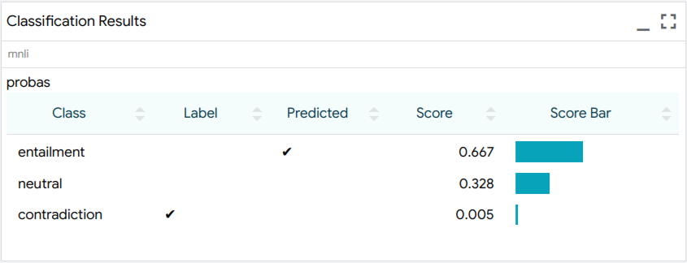<!-- DO NOT REMOVE {style="max-width:600px"} -->

### Regression / Scoring

Regression or scoring models also are well-supported with metrics, bucketed
faceting, and scatterplots of scalar output. Regression is implemented with the
`Scalar` (input) and `RegressionScore` (output) types.

*   Models should define a `RegressionScore` field in their output spec, and for
    each example should return a numerical score.
*   To provide labels for evaluation, the data should define a `Scalar` field
    which contains numerical targets, and the model's `RegressionScore` field
    should set `parent=` to the name of this field.

### Multi-label classification

LIT supports multi-label tasks, when a model can label a single example with
more than one label. Multi-label classification is implemented with the
`SparseMultilabelPreds` and `SparseMultilabel` types.

*   For a basic example on an image labeling task, see [lit_nlp/examples/image_demo.py](../lit_nlp/examples/image_demo.py).
*   Models should define a `SparseMultilabelPreds` field in their output spec
    with the`vocab=` attribute as the set of class labels, and for each example
    should return a list of class score tuples. Each tuple contains two
    elements: a string class label and a non-negative numeric score for that
    class.
*   To provide labels for evaluation, the data should define a
    `SparseMultilabel` field which contains a list of string-valued labels. The
    model's `SparseMultilabelPreds` field should set the `parent=` attribute to
    the name of this field.

### Seq2Seq / Generation

LIT has a number of features for sequence generation models, though support is
not quite as mature as for classification or regression. In particular, LIT can
display single generations as well as scored candidates from beam search, and
can highlight diffs against one or more reference texts. If supported by the
model, LIT can also render per-token output probabilities from a language model
or decoder.

*   Models should define a `GeneratedText` field (for single generation) and
    emit a single string per example, or a `GeneratedTextCandidates` field and
    emit multiple candidates and their scores.
*   To provide target sequences for evaluation, the data should include a
    `TextSegment` field (for a single reference) or a `ReferenceTexts` field
    (for multiple references), and the model's output field should set `parent=`
    accordingly.
*   To use a model in scoring mode over one or more predefined target
    sequences, the model can also output a `ReferenceScores` field (with values
    as `List[float]`) with `parent=` set to reference a `TextSegment` or
    `ReferenceTexts` field from the input.
*   For modeling examples, see
    [lit_nlp/examples/models/t5.py](../lit_nlp/examples/models/t5.py)

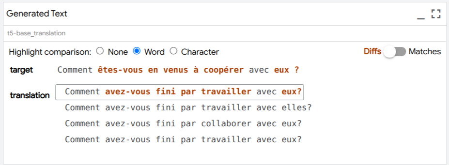<!-- DO NOT REMOVE {style="max-width:600px"} -->

### Span Labeling and Structured Prediction

LIT can support a variety of structured prediction types, and provides rich,
interactive visualizations.

*   For token-aligned output, models should define a `Tokens` field in their
    output, and return a list of tokens for each example.
*   For part-of-speech and other per-token tags, models should define a
    `SequenceTags` type with the `align=` attribute set to the name of the
    appropriate `Tokens` field. For each example, they should return a list of
    tags, one per token.
*   For span labels such as named entities (NER), models can use the
    `SpanLabels` type and return tuples (as `dtypes.SpanLabel`) of
    `(i,j,label)`. Similarly, an `EdgeLabel` type is available for tasks such as
    SRL and dependency parsing that consist of relations between two spans.
*   Experimentally, byte-based annotations are supported via the
    `MultiSegmentAnnotations` type.

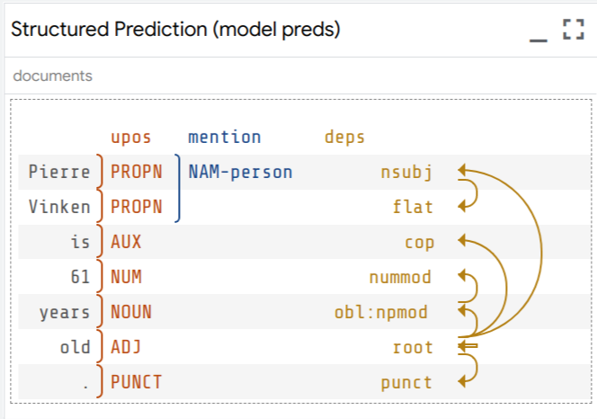<!-- DO NOT REMOVE {style="max-width:400px"} -->

### Multiple input segments

LIT can easily handle multiple text fields, or a mix of text, categorical,
scalar, and other input features. LIT does not explicitly "privilege" one input
field, and metadata in the model spec can be used to align gradients, attention,
and otherwise to different parts of the input.

*   For an example with two-sentence input, see the
    [Dataset class documentation](./api.md#datasets) and the corresponding
    [Model](./api.md#models).
*   For a more involved code example including per-token gradients, see
    [lit_nlp/examples/glue_demo.py](../lit_nlp/examples/glue_demo.py).

### Tabular data

LIT can be used as a replacement for the [What-If Tool](https://whatif-tool.dev)
but with more extensibility, when working with predictions over tabular data.

Some interpreters, such as Kernel SHAP, require models that use tabular data. In
these cases, LIT validates model compatibility by checking that:

*   The model inputs (`input_spec()`) are exclusively categorical
    (`CategoryLabel`) or numeric (`Scalar`), and none of these are marked as
    optional (`required=False`).
*   The model outputs include at least one classification (`MulticlassPreds`),
    regression (`RegressionScore` or `Scalar`), or multilabel
    (`SparseMultilabel`) field.

For a demo using a penguin stats dataset/binary classification task, see
google3/third_party/py/lit_nlp/examples/penguin_demo.py.

### Images

LIT also contains support for models with images as input features or generated
images as model output. The LIT type `ImageBytes` can be used as a feature in
datasets and as part of an input spec or output spec for a model. That feature's
value must be a base64 encoded string for an image.

NOTE: We may transition images away from encoded strings, moving to individual
pixel color values. We will ensure we don't break existing checked-in code with
such a change.

*   See `google3/third_party/py/lit_nlp/examples/datasets/open_images.py` for a
    dataset containing images, including converting images to base64 encoded
    strings.
*   For a demo of an image classifier, see
    `google3/third_party/py/lit_nlp/examples/image_demo.py`.

## Token-based Salience

LIT supports several methods for token-based input salience, including
gradient-based methods as well as black-box techniques like LIME that don't
require any access to model internals. Output is rendered in the Salience Maps
module in the LIT UI, which allows for comparison of multiple methods at once:

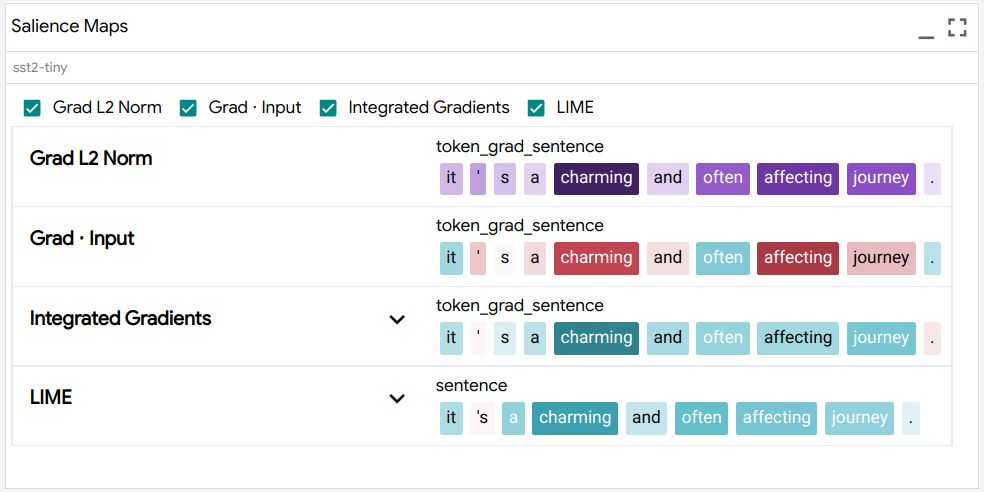<!-- DO NOT REMOVE {style="max-width:600px"} -->

For a demo with a BERT-based classifier, see https://pair-code.github.io/lit/demos/glue.html and navigate to the
"Explanations" tab.

Currently, salience is supported for classification ( `MulticlassPreds`) and
regression (`RegressionScore`) outputs, though we hope to support seq2seq models
soon. Available methods include:

### Gradient Norm

This is a simple method, in which salience scores are proportional to the L2
norm of the gradient, i.e. the score for token $i$ is:

$$S(i) \propto ||\nabla_{x_i} \hat{y}||_2$$

To enable this method, your model should, as part of the
[output spec and `predict()` implementation](./api.md#models):

*   Return a `Tokens` field with values (as `List[str]`) containing the
    tokenized input.
*   Return a `TokenGradients` field with the `align` attribute pointing to the
    name of the `Tokens` field (i.e. `align="tokens"`). Values should be arrays
    of shape `<float>[num_tokens, emb_dim]` representing the gradient
    $\nabla_{x} \hat{y}$ of the embeddings with respect to the prediction
    $\hat{y}$.

Because LIT is framework-agnostic, the model code is responsible for performing
the gradient computation and returning the result as a NumPy array. The choice
of $\hat{y}$ is up to the developer; typically for regression/scoring this is
the raw score and for classification this is the score of the predicted (argmax)
class.

### Gradient-dot-Input

In this method, salience scores are proportional to the dot product of the input
embeddings and their gradients, i.e. for token $i$ we compute:

$$S(i) \propto x_i \cdot \nabla_{x_i} \hat{y}$$

Compared to grad-norm, this gives directional
scores: a positive score is can be interpreted as that token having a positive
influence on the prediction $\hat{y}$, while a negative score suggests that
the prediction would be stronger if that token was removed.

To enable this method, your model should, as part of the
[output spec and `predict()` implementation](./api.md#models):

*   Return a `Tokens` field with values (as `List[str]`) containing the
    tokenized input.
*   Return a `TokenEmbeddings` field with values as arrays of shape
    `<float>[num_tokens, emb_dim]` containing the input embeddings $x$.
*   Return a `TokenGradients` field with the `align` attribute pointing to the
    name of the `Tokens` field (i.e. `align="tokens"`), and the `grad_for`
    attribute pointing to the name of the `TokenEmbeddings` field. Values should
    be arrays of shape `<float>[num_tokens, emb_dim]` representing the gradient
    $\nabla_{x} \hat{y}$ of the embeddings with respect to the prediction
    $\hat{y}$.

As with grad-norm, the model should return embeddings and gradients as NumPy
arrays. The LIT `GradientDotInput` component will compute the dot products and
appropriate normalization.

### Integrated Gradients

Integrated gradients is a more robust method for estimating feature
contribution, based on integrating a gradients along a path in embedding space.
See [Sundararajan et al. 2017](https://arxiv.org/abs/1703.01365) for additional
detail on the algorithm. This method may give better results than grad-norm and
grad-dot-input, but also requires more involved instrumentation of the model.

To support this method, your model needs to return the gradients and embeddings
needed for grad-dot-input, and also to *accept* modified embeddings as input.

*   The model output should be as for grad-dot-input.
*   The model should have an [optional input](./api.md#optional-inputs) of type
    `TokenEmbeddings` with the same name as the output `TokenEmbeddings` field
    (see [type system conventions](./api.md#conventions)), which will be used to
    feed in the interpolated inputs as arrays of shape `<float>[num_tokens,
    emb_dim]`.
*   The model should have an additional field ("grad_class", below) which is
    used to pin the gradients to a particular target class. This is necessary
    because we want to integrate gradients with respect to a single target
    $\hat{y}$, but the argmax prediction may change over the integration path.
    This field can be any type, though for classification models it is typically
    a `CategoryLabel`. The value of this on the original input (usually, the
    argmax class) is stored and fed back in to the model during integration.
    This field should be present as optional in the input spec (see below), and
    the name of the field should be referenced by the `grad_target_field_key`
    attribute of the `TokenGradients` field.

An example spec would look like:

```python
   def input_spec(self):
     return {
         # ...
         "token_embs": lit_types.TokenEmbeddings(align='tokens', required=False),
         "grad_class": lit_types.CategoryLabel(vocab=self.LABELS, required=False),
         # ...
     }

   def output_spec(self):
     return {
         # ...
         "tokens": lit_types.Tokens(parent="input_text"),
         "token_embs": lit_types.TokenEmbeddings(align='tokens'),
         "grad_class": lit_types.CategoryLabel(vocab=self.LABELS),
         "token_grads": lit_types.TokenGradients(align='tokens',
                                                 grad_for="token_embs",
                                                 grad_target_field_key="grad_class"),
         # ...
     }
```

For a more concrete example that also supports multiple segments with separate
gradients, see our
[BERT classifier demo model](../lit_nlp/examples/models/glue_models.py),
or contact the LIT team for assistance.

### LIME

[LIME](https://arxiv.org/abs/1602.04938) is a black-box salience method that
does not require access to any model internals. It works by generating a set of
perturbed inputs - generally, by dropping out or masking tokens - and training a
local linear model to reconstruct the original model's predictions. The weights
of this linear model are treated as the salience values.

The trade-off, compared to gradient-based methods, is that computing LIME can be
slow as it requires many evaluations of the model. Additionally, LIME can be
noisy on longer inputs, as there are more tokens to ablate. To compensate, you
can increase the number of samples:

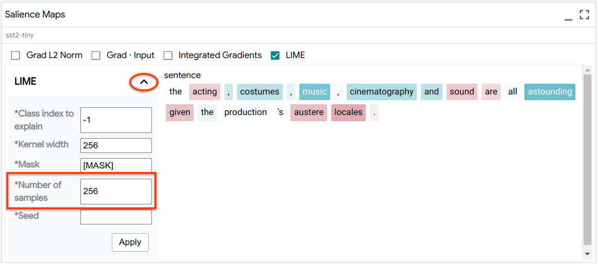<!-- DO NOT REMOVE {style="max-width:600px"} -->

LIME works out-of-the-box with any classification (`MulticlassPreds`) or
regression/scoring (`RegressionScore`) model.

### Salience Clustering

LIT includes a basic implementation of the salience clustering method from
[Ebert et al. 2022](https://arxiv.org/abs/2211.05485), which uses k-means on a
salience-weighted bag-of-words representation to find patterns in model
behavior. This method is available using any of the token-based salience methods
above, and if enabled will appear in the "Salience Clustering" tab:


To run clustering, select a group of examples or the entire dataset, choose a
salience method, and run using the "Apply" button. The result will be a set of
top tokens for each cluster, as in Table 6 of
[the paper](https://arxiv.org/pdf/2211.05485.pdf).

## Pixel-based Salience

LIT also supports pixel-based salience methods, for models that take images as
inputs. Output is rendered in the Salience Maps module in the LIT UI, which
allows for comparison of multiple methods at once.

To enable pixel-based salience methods for models that take images as inputs,
your model should, as part of the
[output spec and `predict()` implementation](./api.md#models):

*   Return a `ImageGradients` field with the `align` attribute pointing to the
    name of the `ImageBytes` field and, optionally, the `grad_target_field_key`
    attribute pointing to the `CategoryLabel` field in input spec that specifies
    the target class for which to take gradients, if the model can process that
    as an input. Without this gradient target field key, the model should return
    gradients with respect to the argmax class for classification models. The
    model should also return the actual class for which the gradients have been
    computed in the `grad_target` output field. The values returned in this
    field (as `<float>[image_height, image_width, color_channels]`) should be
    the gradients with respect to each pixel in each color channel in the 2D
    input image.

    The model should be able to accept input images as numpy arrays in addition
    to accepting base64 URL encoded format. See
    [mobilenet.py](../lit_nlp/examples/mobilenet.py)
    for an example.

A variety of image saliency techniques are implemented for models that return
image gradients, through use of the
[PAIR-code saliency library](https://github.com/PAIR-code/saliency), including
integrated gradients, guided integrated gradients, blurred integrated gradients,
and XRAI.

Each of these techniques returns a saliency map image as a base64-encoded string
through the `ImageSalience` type.

## Attention

LIT can display a visualization of attention heads from transformers and other
models:

<!-- DO NOT REMOVE {style="max-width:400px"} -->

To enable this, your model should return one or more fields of the type
`AttentionHeads`, with values as arrays of shape `<float>[num_heads, num_tokens,
num_tokens]`. Each field represents a set of heads at a single layer of the
model, so models will often have more than one:

```python
   def output_spec(self):
     return {
         # ...
         "tokens": lit_types.Tokens(parent="input_text"),
         "layer_0/attention": lit_types.AttentionHeads(align_in="tokens", align_out="tokens"),
         "layer_1/attention": lit_types.AttentionHeads(align_in="tokens", align_out="tokens"),
         "layer_2/attention": lit_types.AttentionHeads(align_in="tokens", align_out="tokens"),
         # ...
     }
```

The `align_in` and `align_out` attributes are the names of `Tokens` fields for
the source and target tokens for that layer. For self-attention (such as in
BERT) these would name the same field, but for encoder-decoder attention they
could reference different token sets (such as "input_tokens" and
"target_tokens").

## Embedding Projector

LIT includes a version of the
[embedding projector](https://projector.tensorflow.org/) which can be used to
visualize the latent space of your model, in order to find clusters or patterns
in the data. [UMAP](https://umap-learn.readthedocs.io/en/latest/) and PCA are
both supported as projection techniques.

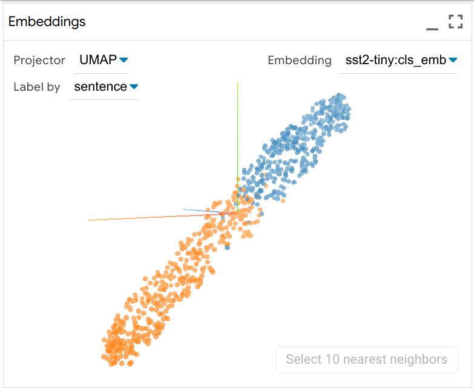<!-- DO NOT REMOVE {style="max-width:500px"} -->

The plot can be panned, zoomed, and rotated, and you can click a point to select
an example, or shift-click to select a group. You can also use LIT's global
colormap (the "Color By" menu) to color points by features such as the original
label, the model's predictions, or another categorical feature from the input.

To enable the embedding projector, your model should return one or more
`Embeddings` fields, with corresponding values as fixed-length vectors
`<float>[emb_dim]` for each example.

## Aggregate Analysis

### Metrics

LIT includes common metrics for classification, regression, and seq2seq (BLEU)
by default, which will appear in the table when the appropriate types are
present in the model output and input data. Metrics can be computed on the whole
dataset, a selected subset, or on facets defined by particular features. For
example, we could facet by class label:

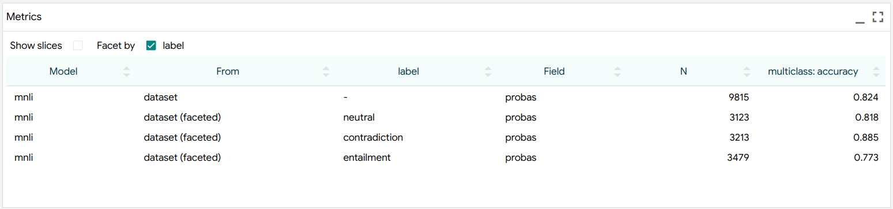

To try this out, see https://pair-code.github.io/lit/demos/glue.html and navigate to the "Performance" tab.

To enable metrics, your model should set the `parent` attribute on one or more
output fields, pointing to the name of the input field that it should be
evaluated against. For example, for classification, the data spec might have:

```python
    def spec(self):
      return {
          # ...
          "label": lit_types.CategoryLabel(vocab=self.LABELS),
          # ...
      }
```

and the model would include:

```python
    def output_spec(self):
      return {
          # ...
          "probas": lit_types.MulticlassPreds(vocab=self.LABELS, parent='label'),
          # ...
      }
```

Custom metrics can be easily defined in Python; see the
[API documentation](./api.md#metrics) for more.

### Confusion Matrix

LIT includes a powerful and flexible confusion matrix, which can be used to
compare predictions to gold labels as well as to compare between two models or
between different categorical features. You can click cells or row/column
headers to select a subset of examples, which is useful for intersectional
analysis.

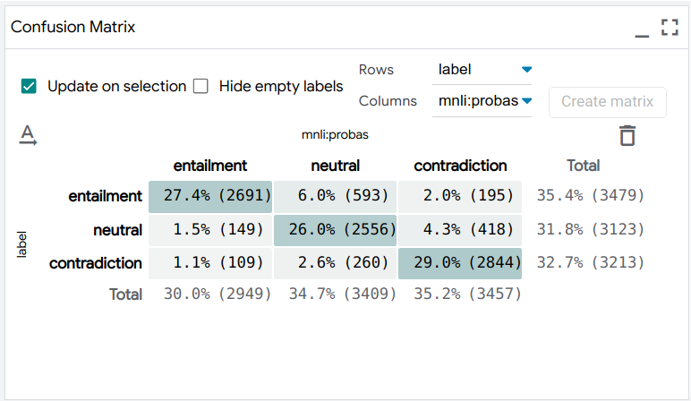<!-- DO NOT REMOVE {style="max-width:600px"} -->

To try this out, see https://pair-code.github.io/lit/demos/glue.html and navigate to the "Performance" tab.

The confusion matrix is supported for classification models, or if the input
data includes any categorical features (`CategoryLabel`).

### Scalar Plots

LIT includes scatterplots for scalar features, including plain scalars (`Scalar`
or `RegressionScore`) as well as per-class probabilities from classification
output (`MulticlassPreds`).

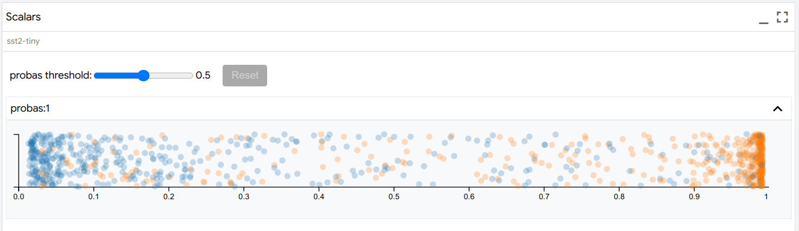

You can click individual points to select them, or drag to select all examples
in a range of scores - for example, to find examples near the decision boundary.
The plots also respond to LIT's global colormap (the "Color By" menu), which can
color points by categorical features or the model's predicted class.

To try this out, see https://pair-code.github.io/lit/demos/glue.html and navigate to the "Predictions" tab.

### Binary Classification Thresholds

For binary classification models, LIT contains a module for setting
classification thresholds, which determine at what score for the positive class
the model determines that an example should be classified as belonging to the
positive class.

This threshold can be set either on the entire dataset, or can be set separately
on faceted subsets of the dataset. Checkboxes in this module are used to select
which features in the dataset will be used to create the faceted subsets.
Multiple features can be selected, which leads to intersectional subsets.

Additionally, if the dataset has ground truth labels for the value being
predicted, then the module can calculate the optimal value to set these
thresholds. The cost ratio input box allows setting of the relative penalty of
the model producing a false positive, compared to a false negative. By default,
this is set to 1, meaning that false positives and false negatives are equally
costly, in terms of how we should calculate the optimal threshold(s). Setting it
to 2 would mean that false positives are twice as costly as false negatives, and
setting it to .5 would mean that false negatives are twice as costly as false
positives.

The "Get optimal threshold" button will calculate optimal thresholds for each
subset specified by the checkboxes, or the entire dataset if no subsets are
created. These are displayed in the thresholds table along with the slider to
manually change the thresholds. The buttons in the table header allow easy
setting of those optimal thresholds.

When the dataset is faceted into subsets, along with calculating optimal
individual thresholds per subset, and an optimal overall threshold for the
entire dataset, a number of other threshold sets are calculated. These are based
on different fairness constraints that may be of interest to the user.

One such constraint is demographic parity, which attempts to have an equal
percentage of positive classifications for each subset. Another is equal
accuracy, which attempts to have an equal accuracy score for each subset. There
is also equal opportunity, which attempts to equalize for each subset the
percentage of positive predictions among those datapoints with a positive ground
truth label.

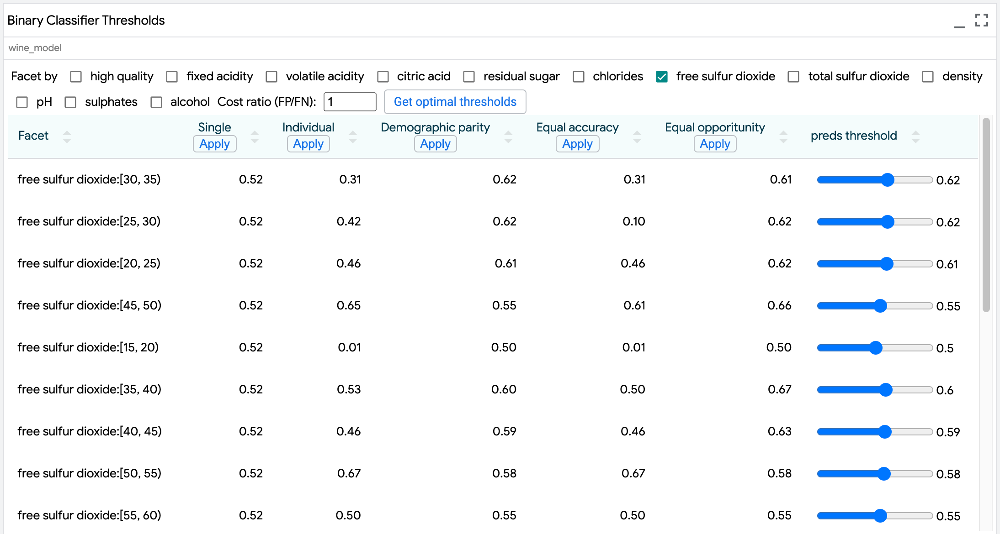

### Partial Dependence Plots

For classification or regression models with `CategoryLabel` or `Scalar` input
features, the Partial Dependence Plots module shows plots indicating the effect
that changing those individual features has on model output.

If a single datapoint is selected, then a feature's plot shows the effect of
changing that one value has on model output. For numeric features, the model
output is calculated for 10 different values, ranging from the minimum value of
that feature in the dataset to its maximum value in the dataset, and the results
are shown in the line chart. For categorical features, the model output is
calculated for all values of that feature from the `vocab` specified in the
`CategoryLabel` for that feature, and the results are shown in a column chart.

If multiple datapoints are selected, then the model outputs are calculated using
the same logic for each datapoint, and the outputs are averaged to create the
points on the line or column charts. In this way, the charts show the average
effect of that feature on model output, given the datapoints chosen.

If no datapoints are selected, then the calculations are done across all
datapoints, giving a global view of feature effects.

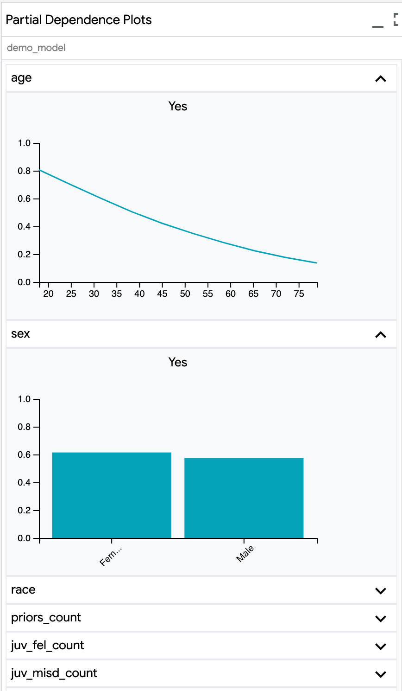<!-- DO NOT REMOVE {style="max-width:400px"} -->

### Dive

Dive is a visualization module, inspired by our prior work on
[Facets Dive](https://pair-code.github.io/facets/) and its use in the
[What-If Tool](https://pair-code.github.io/what-if-tool/), that enables
exploration of data subsets grouped by feature values.

<!-- DO NOT REMOVE {style="max-width:500px"} -->

Data are displayed in a matrix of groups based on feature values, with each
group containing the datapoints at the intersection of the feature values for
that column and row. Use the drop-downs at the top to select the feature to use
for the rows and columns in the matrix. You can use the "Color By" drop-down in
the main toolbar to change the feature by which datapoints are colored in the
matrix.

This visualization is powered by
[Megaplot](https://github.com/PAIR-code/megaplot), which allows it to support up
to 100k datapoints. Dive support mouse-based zoom (scroll) and pan (drag)
interactions to help you navigate these very large datasets. You can also use
the "zoom in", "zoom out", and "reset view" buttons in the module toolbar to
help navigate with more precision.

Dive is currently integrated in the
[Penguins demo](https://pair-code.github.io/lit/demos/penguins.html), and will
be supported in other demos in future releases.

## TCAV

Many interpretability methods provide importance values per input feature (e.g,
token). By contrast, [TCAV](https://arxiv.org/abs/1711.11279) shows the
importance of high-level concepts (e.g., color, gender, race) for a prediction
class, which is more akin to how humans communicate.

From those examples, TCAV learns a vector representing those concepts in a model
layer, which we call a concept activation vector (CAV). A CAV is learned using a
linear classifier. Intuitively, CAV measures how sensitive prediction is to the
concept (i.e., directional derivative of the prediction with respect to the
CAV). Unlike many local attribution methods mentioned above, TCAV is a global
method. This means that TCAV explains "a class" rather than "a data point". TCAV
does this by aggregating concepts' influence on data points in a class (i.e.,
ratio of data points with positive directional derivatives).

The TCAV method can be applied to models with any input modality. To enable
TCAV, your model should return one or more example-level Embeddings fields for a
layer, the predicted class, and the corresponding gradient values for that layer
and class.

### Example

1.) To use TCAV, begin by creating one or more 'concept' slices.

Every dataset/model is different, but for images, as low as 15 data points are
shown to be sufficient. Start by adding at least 3 data points and add more as
needed

For this example, we select all examples related to acting in the data table
using the selector `acting|actor|actress`.

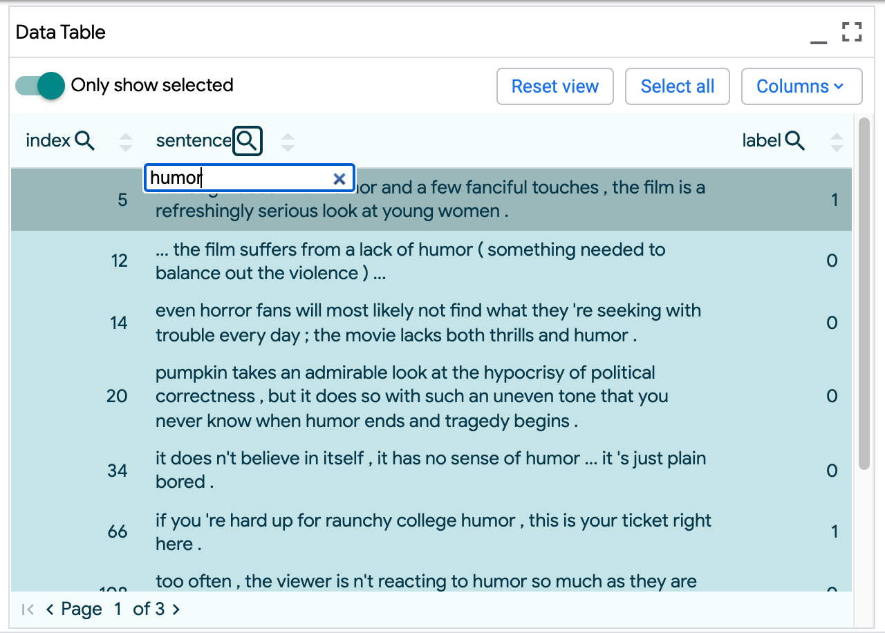<!-- DO NOT REMOVE {style="max-width:400px"} -->

2.) Next, name the slice `acting` and click 'Create slice'.

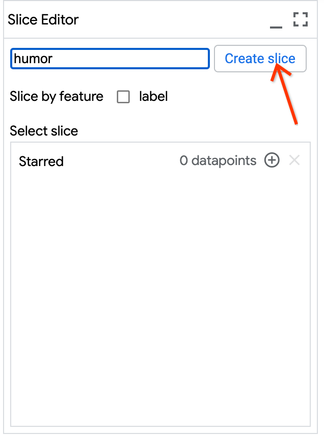<!-- DO NOT REMOVE {style="max-width:280px"} -->

3.) Finally, navigate to the TCAV tab, select the newly created slice, and click
'Run TCAV'.

This initiates standard TCAV, which compares the selected examples against
random splits of examples in the rest of the dataset. Alternatively, selecting a
second 'negative' slice would initiate relative TCAV, which compares the
selected slice's examples against those in the negative slice.

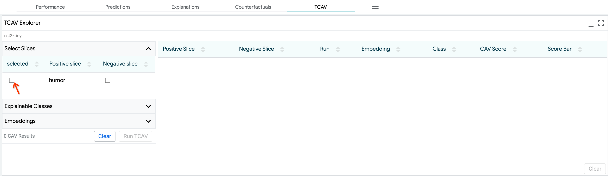<!-- DO NOT REMOVE {style="max-width:800px"} -->

When the run is complete (usually after a few seconds), the results are
displayed in the table. In this example, the TCAV score is ~0.9 (shown by the
blue bar in the score bar), which is higher than the baseline (shown as the
black bar in the score bar ), indicating that the acting concept positively
influences the prediction class 1, or positive sentiment. (Technically, the
baseline represents 'null hypothesis', calculated with random concepts.)

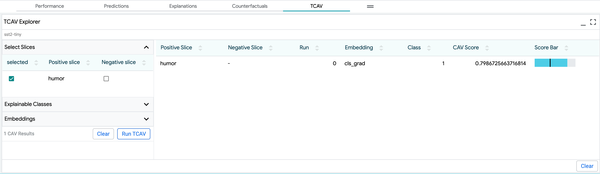<!-- DO NOT REMOVE {style="max-width:800px"} -->

### Statistical Significance

One of the pitfalls with the TCAV method is the potential generating meaningless
CAVs, since any randomly chosen set of images will still produce a CAV (even if
it is not meaningful).

To guard against this, we use statistical testing to verify whether CAVs are
statistically significant. For standard TCAV, we generate 15 possibly meaningful
CAVs using the selected concept slice and random splits of the same size from
the remainder of the dataset. We also generate 15 random CAVs using random
splits against random splits. We then do a t-test to check if these two sets of
scores are from the same distribution and reject CAVs as insignificant if the
p-value is greater than 0.05. (If this happens, a warning is displayed in place
of the TCAV score in the UI.)

For relative TCAV, users would ideally test concepts with at least ~100 examples
each so we can perform ~15 runs on unique subsets. In practice, users may not
pass in this many examples.

To accommodate this, we use a cross-validation approach, where we will try
different subset split sizes, and return one with a statistically significant
result (when compared against random CAVs). We set the minimum number of
examples to run TCAV at 3 examples, and need at least 2 runs for statistical
testing. If there are too few examples for this, we will perform 1 run of size
min(concept set length, negative set length), and return the result without
statistical testing (which is indicated in the UI).

### Sorting by Cosine Similarity

The option to sort examples by cosine similarity to a CAV will be available in
an upcoming release.

## Counterfactual Analysis

While aggregate metrics can give a picture of overall behavior, and salience
maps can give quick insight into a model's local behavior, many questions about
model behavior are best answered in a counterfactual setting: "How does my model
behave under a controlled change in inputs?"

For example, you might want to see what happens if a single token is deleted, a
word is substituted, or some systematic transformation - like paraphrasing or an
adversarial attack - is applied to the whole dataset. LIT includes features to
explore this, both through manual edits and through automatic "generator"
components.

### Manual Editing

Examples can be edited manually in the Datapoint Editor module:

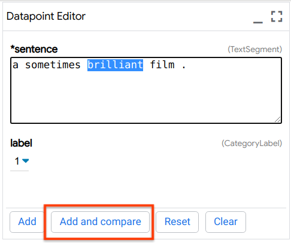<!-- DO NOT REMOVE {style="max-width:400px"} -->

The "Add and Compare" button can be used to enter comparison mode, which will
automatically "pin" the original example as a reference selection. Many LIT
modules will automatically duplicate to show the predictions on this example
side-by-side with the original. For example:

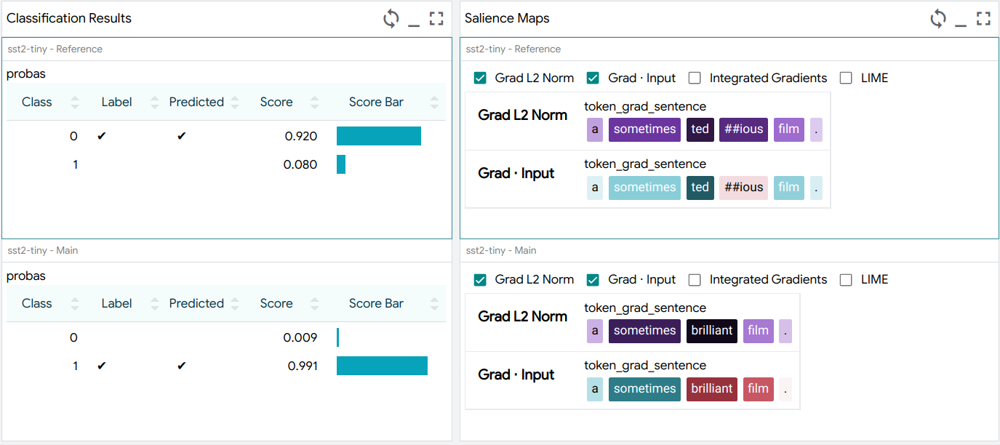

You can also use the toolbar controls to enter comparison mode. LIT also keeps
track of the relationship between examples, and you can use the pair selection
controls to cycle through the available (original, edited) examples:

<!-- DO NOT REMOVE {style="max-width:700px"} -->

### Generators

The **Generator Module** supports automatic generation of counterfactuals
through a variety of plug-in components:

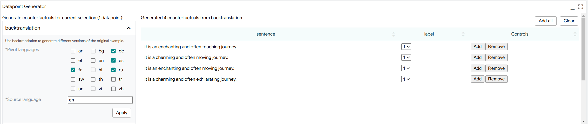

Semantically, generators are Python classes which take one or more input
examples and return a new set of transformed examples. This can include simple
transformations such as scrambling word order or making regex substitutions, or
more complex methods such as back-translation or adversarial methods such as
[HotFlip](https://arxiv.org/abs/1712.06751).

Generators can be easily defined using the [Python API](./api.md#generators) and
customized for particular applications or domains.

We also include a handful of off-the-shelf methods:

*   The
    [**scrambler**](../lit_nlp/components/scrambler.py)
    simply randomizes word order of the input.
*   The
    [**word replacer**](../lit_nlp/components/word_replacer.py)
    makes simple substitutions, such as `great -> terrible`.
*   [**HotFlip**](../lit_nlp/components/hotflip.py)
    ([Ebrahimi et al. 2017](https://arxiv.org/abs/1712.06751)) tries to find
    minimal token substitutions to change the model's prediction. Compatible
    with classification models (`MulticlassPreds`) or regression models
    (`RegressionScore`) via thresholding, and requires access to
    `TokenGradients` as well as a special `get_embedding_table()` method on the
    model class.
*   [**Ablation Flip**](../lit_nlp/components/ablation_flip.py)
    is similar to HotFlip, but tries to change the prediction by selectively
    dropping tokens from the input. Unlike HotFlip, this does not require
    gradients or access to the embedding table and can work with any
    classification or regression model.
