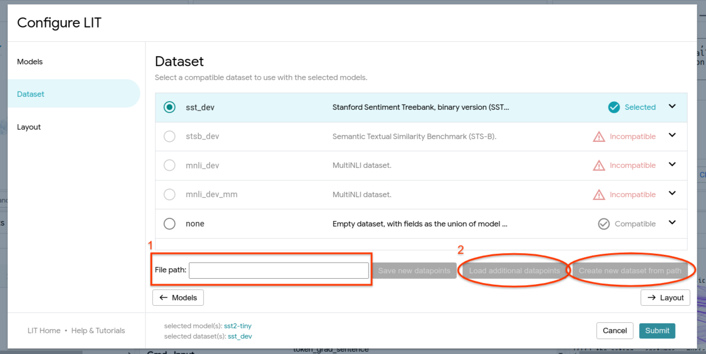

# Frequently Asked Questions

<!--* freshness: { owner: 'lit-dev' reviewed: '2022-11-07' } *-->

<!-- [TOC] placeholder - DO NOT REMOVE -->

## Scale

### Dataset Size

LIT can comfortably handle 10k-100k datapoints, depending on the speed of the
server (for hosting the model) and your local machine (for viewing the UI). When
working with large datasets, there are a couple caveats:

*   LIT expects predictions to be available on the whole dataset when the UI
    loads. This can take a while if you have a lot of examples or a larger model
    like BERT. In this case, we recommend adding the flag `--warm_start=1` (or
    pass `warm_start=1` to the `Server` constructor in Python) to pre-compute
    predictions before starting the server.

*   Datasets containing images may take a while to load. If full "native"
    resolution is not needed (such as if the model operates on a smaller size
    anyway, such as 256x256), then you can speed things up by resizing images in
    your `Dataset` loading code.

*   LIT uses WebGL for the embedding projector (via
    [ScatterGL](https://github.com/PAIR-code/scatter-gl)) and for the Scalars
    and Dive modules (via [Megaplot](https://github.com/PAIR-code/megaplot)),
    which may be slow on older machines if you have more than a few thousand
    points.

If you have more data, you can use `Dataset.sample` or `Dataset.slice` to select
a smaller number of examples to load. You can also pass individual examples to
LIT [through URL params](#sending-examples-from-another-tool), or load custom
data files at runtime using the settings (⚙️) menu.

### Large Models

LIT can work with large or slow models, as long as you can wrap them into the
model API. If you have more than a few preloaded datapoints, however, you'll
probably want to use `warm_start=1` (or pass `--warm_start=1` as a flag) to
pre-compute predictions when the server loads, so you don't have to wait when
you first visit the UI.

Also, beware of memory usage: since LIT keeps the models in memory to support
new queries, only so many models can fit on a single node or GPU. If you want to
load more or larger models than can fit in local memory, you can host your model
with your favorite serving framework and connect to it using a custom
[`Model`](api.md#models) class.

We also have experimental support for using LIT as a lightweight model server;
this can be useful, e.g., for comparing an experimental model running locally
against a production model already running in an existing LIT demo. See
[`remote_model.py`](../lit_nlp/components/remote_model.py)
for more details.

## Privacy and Security

LIT allows users to query the model, as well as to view the loaded evaluation
data. The LIT UI state is ephemeral and exists only in the browser window;
however, model predictions and any newly-generated examples (including as
manually entered in the web UI) are stored in server memory, and if `--data_dir`
is specified, may be cached to disk.

LIT has the ability to create or edit datapoints in the UI and then save them to
disk. If you do not want the tool to to be able to write edited datapoints to
disk, then pass the `--demo_mode` runtime flag to the LIT server.

### Managing Access

The default LIT development server does not implement any explicit access
controls. However, this is just a thin convenience wrapper, and the underlying
WSGI App can be easily exported and used with additional middleware layers or
external serving frameworks. See
[Running LIT in a Docker container](./docker.md) for an example of this usage.

## Languages

All strings in LIT are unicode and most components use model-provided
tokenization if available, so in most cases non-English languages and non-Latin
scripts should work without any modifications. For examples, see:

*   [XNLI demo](../lit_nlp/examples/xnli_demo.py) -
    cross-lingual NLI, with up to 15 languages supported via a multilingual BERT
    model.
*   [T5 demo](../lit_nlp/examples/t5_demo.py) -
    includes WMT data for machine translation

## Data Types

In addition to text, LIT has good support for different input and output
modalities, including images and tabular data. For examples, see:

*   [Image demo](../lit_nlp/examples/image_demo.py) -
    image classification, using a Mobilenet model.
*   [Tabular demo](../lit_nlp/examples/penguin_demo.py) -
    mult-class classification on tabular (numeric and categorical string) data,
    using the
    [Palmer Penguins](https://www.tensorflow.org/datasets/catalog/penguins)
    dataset.

For more details, see [the features guide to input and output types](api.md#input-and-output-types).

## Workflow and Integrations

### Sending examples from another tool

LIT can read input fields directly from the URL; they should be encoded as
`data_<fieldname>=<value>`, and field names should match those in the (default)
dataset.

There is also (experimental) support for sending more than one example, as long
as the total URL length is within the browser's size limit. Specify as above,
but using `data0`, `data1`, `data2`, e.g. `data0_<fieldname>=<value>`.

### Downloading or exporting data

Currently, there are three ways to export data from the LIT UI:

-   In the Data Table, you can copy or download the current view in CSV format -
    see [the UI guide](./ui_guide.md#data-table) for more details.
-   In the "Dataset" tab of the settings (⚙️) menu, you can enter a path to save
    data to. Data is pushed to the server and written by the server backend, so
    be sure the path is writable.

-   If using LIT in a Colab or other notebook environment, you can access the
    current selection from another cell using `widget.ui_state.primary`,
    `widget.ui_state.selection`, and `widget.ui_state.pinned`.

### Loading data from the UI

There is limited support for this via the settings (⚙️) menu. Select a dataset,
and enter a path to load from:

The supported format(s) depend on the dataset class; in most cases, the user
should implement the `load()` method on their dataset class to handle the
appropriate format.

### Using components outside the LIT UI

Python components such as models, datasets, and generators are designed to
support standalone use. These don't depend on the LIT serving framework, and you
can treat them as any other Python class and use from Colab, regular scripts,
bulk inference pipelines, etc. For an example, see
[the API documentation](./api.md#using-components-outside-lit).

For the frontend, it's a little more difficult. In order to respond to and
interact with the shared UI state, there's a lot more "framework" code involved
(see the [frontend development guide](./frontend_development.md) for more).
We're working on refactoring the LIT
[`modules`](../lit_nlp/client/modules) to separate
framework and API code from the visualizations (e.g.
[`elements`](../lit_nlp/client/elements)), which can
then be re-used in other environments.

### Training models with LIT

LIT is primarily an evaluation/inference-time tool, so we don't provide any
official training APIs. However, to facilitate code reuse you can easily add
training methods to your model class. In fact, several of our demos do exactly
this, using LIT's `Dataset` objects to manage training data along with standard
training APIs (such as Keras' `model.fit()`). See
[`quickstart_sst_demo.py`](../lit_nlp/examples/quickstart_sst_demo.py)
and/or
[`glue_models.py`](../lit_nlp/examples/models/glue_models.py)
for examples.
