# UI Guide

<!--* freshness: { owner: 'lit-dev' reviewed: '2022-11-07' } *-->

This is a user guide for the Learning Interpretability Tool (LIT) UI.

For a quick video tour of LIT, check out this
[video](https://www.youtube.com/watch?v=CuRI_VK83dU).

<!-- [TOC] placeholder - DO NOT REMOVE -->

## General Layout

LIT lives inside a single page web application, comprised of multiple toolbars
and a main section consisting of individual modules. Modules will automatically
display if they are applicable to the current model and dataset; for example,
the module that shows classification results will only show if the model returns
`MulticlassPreds`.

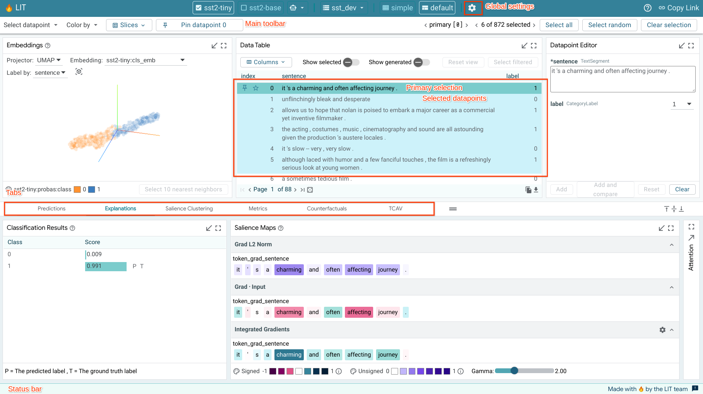

In general, the module layout consists of two sections, a top section and a
bottom section, separated by a draggable divider to control the height of each
section. The top section contains a single set of modules, always shown in the
tool. This section is generally used for the main modules that are critical to
tool navigation, such as the data table and datapoint editor. The bottom section
is comprised of tabs that contain any number of individual modules. The tabs in
this section are generally grouped into task-specific sets of modules.

## Datapoint Selections

LIT displays a loaded dataset and its model results across the set of selected
models. Users can dive into detailed results by selecting datapoints from the
dataset.

There are two selection concepts that LIT users need to be aware of. The first
concept is the current selection, which consists of one or more datapoints that
are selected through one of the interactive modules (such as the *Data Table*,
*Embeddings*, *Scalars*, or *Confusion Matrix* module). When a set of
datapoints are selected in a module, this selection is reflected across all
other modules, along with the selection toolbar. For example, the *Metrics*
module shows model metrics not just across the entire dataset, but also for the
current selection of datapoints.

The second concept is the primary selection. The primary selection is a single
datapoint within the current selection that is being explored in more detail in
modules that focus on a single datapoints (such as the *Datapoint Editor* and
*Salience Maps* modules). If the current selection only consists of a single
datapoint, then that datapoint is also the primary selection. If the current
selection consists of multiple datapoints, the primary selection defaults to the
first datapoint in that selection but can be changed through the arrow controls
in the selection toolbar or by clicking another datapoint in the selection. The
primary selection is highlighted in a darker blue in the *Data Table* module and
its ID is displayed in the selection toolbar.

A selection of datapoints can be saved as a "slice" through the *Slice Editor*.
Saving a selection as a slice allows for easy navigation back to that
selection in the future. It also allows for comparison of metrics across subsets
of datapoints, as described in the *[Metrics Module](#metrics-table)* section.

## Toolbars

There are three toolbars in the LIT tool. The top bar includes the tool name,
selected model(s) and dataset, and a settings button. Below that is the main
toolbar with the menus and controls for navigation and selection control.
At the bottom of the page is a status bar.

### Global Settings

The global settings dialog is accessible through the settings icon in the top
bar.

LIT can be launched with a set of models and datasets. The settings screen
allows users to select which models to analyze. Any number of models can be
analyzed together, assuming they are compatible in the input data format they
use (i.e. two different toxicity classifiers can be analyzed together for
comparison). Once a model or models is selected, you can then select from any
dataset compatible with those models.

The settings dialog also contains controls switching the layout of the tool.
This can help declutter the UI when analysis doesn't require all of the
compatible modules that LIT contains.

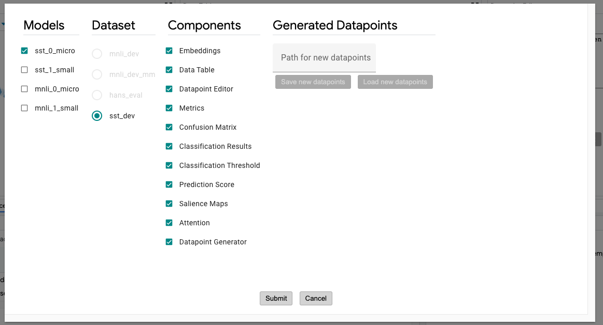<!-- DO NOT REMOVE {width="600"} -->

### Main Toolbar

The main toolbar is right below the top bar and contains a number of
different controls and information. On the left side of the toolbar, it contains
a set of menus for quick controlling of datapoint selection and coloring. This
includes controls such as:

*   The **"Select related"** option looks at all the datapoints in the current
    selection and adds any datapoints "related" to them to the current
    selection. In LIT, "related" is defined as datapoints created from some
    source datapoint (through manual editing or a datapoint generator), or a
    source datapoint that a selected datapoint was created from.
*   The **"Clear selection"** button deselects all selected datapoints.
    The dropdown also contains a color legend for the current color setting.
*   The **Slices** option allows quick selection of an already-created slice of
    datapoints.
*   The **"Datapoint color"** menu enables setting of the color of each
    datapoint in the modules that visualize all datapoints (such as the
    *Embeddings* and *Scalars* modules) by any number of datapoint
    features or model outputs on those datapoints (such as coloring by some
    categorical input feature, or by prediction error for a regression task).

Next to the menus is a button for pinning/unpinning a datapoint. Pinning a
datapoint puts LIT into datapoint comparison mode, where two datapoints can be
compared against each other, across all applicable modules. This mode is
described in more detail [below](#comparing-datapoints).

On the right side of the toolbar, it displays
how many datapoints are in the loaded dataset and how many of those are
currently selected. The ID of the primary selected datapoint is displayed, along
with a favorite button to mark this datapoint as a favorite. Favorited
datapoints are stored in the automatically-created **"Favorites"** slice,
accessible in the slice controls. If only a single datapoint is selected, then
the left and right arrow buttons in this toolbar allow cycling of the selected
datapoint through the loaded dataset. If the current selection is a set of
datapoints, then the left and right arrow buttons control which of those
datapoints is the primary selected datapoint, cycling through the datapoints in
the current selection. A **"random"** button between the arrows allows selection
of a random datapoint, as opposed to the ordered cycling done through the left
and right arrows.

### Status Bar

The status bar at the bottom of the tool contains a text area on the left side.
If the tool is currently waiting on the results of a call to the backend (such
as for running predictions or getting embeddings), this information will be
displayed in the status bar along with an indeterminant progress bar showing
that a result is pending. If a call to the backend fails, information about the
failure will be displayed in this area in red to call out the error, and that
information will persist in the status bar until the user clicks the **"x"**
button by the error to clear the status display.

## Comparing Models

By loading more than one model in the global settings controls, LIT can compare
multiple models. A subset of modules that show per-model information are then
duplicated to allow easy comparison across two models. Other modules, such the
*Embeddings* and *Metrics* modules are updated to show information from all
models.

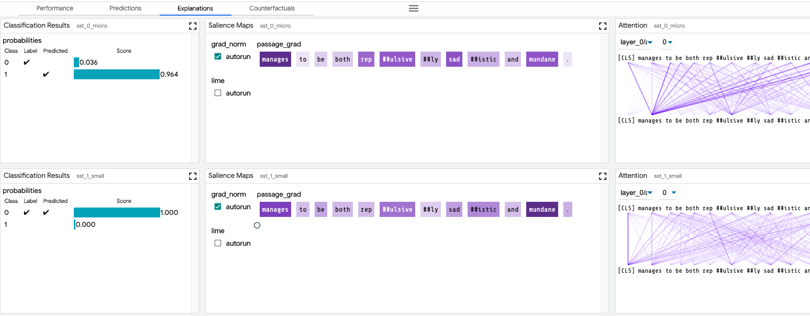

## Comparing Datapoints

Pinning a datapoint, through either the toolbar button or controls in modules
(e.g., the pin icons in Data Table rows), puts LIT into 
**datapoint comparison mode**. In this mode, the pinned datapoint is used as a
reference to compare the primary selection. The pinned datapoint is indicated 
by a pin icon in modules that support datapoint comparison, such as the Data
Table. Any changes to the primary selection will update datapoint comparison
visualizations in all supporting modules.

As with model comparison, some modules may be duplicated, one showing the pinned
datapoint and one showing the primary selected datapoint.

This allows for easy comparison of model results on a datapoint to any generated
counterfactual datapoints, or any other datapoint from the loaded dataset.

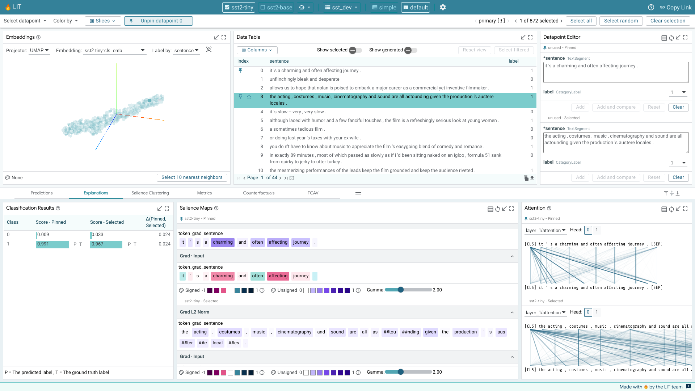

## Slices

The *Slice Editor* allows for creating, editing, selecting, and deleting of
slices. The current selection can be saved as a slice by giving it a name and
clicking "Create slice". The slice list allows you to select any of
the previously-saved slices. This includes the "Favorites" slice that is
described above in the [Main Toolbar](#main-toolbar) section.

The feature checkboxes enable the user to facet the data by input feature when
creating a slice. In the screenshot below, we are creating a new slice named
"interesting", and have selected the checkbox to facet by the "label" feature.
In this example, the "label" feature is a feature in the dataset that for each
datapoint describes which ground truth class it belongs to for some
classification task (either "0" or "1" for this binary classification example).
So, by creating a slice with this checkbox enabled, the tool will actually
create two slices: one named "interesting label:0" for datapoints with their
label set to 0, and one named "interesting label:1" for those with their label
set to "1".

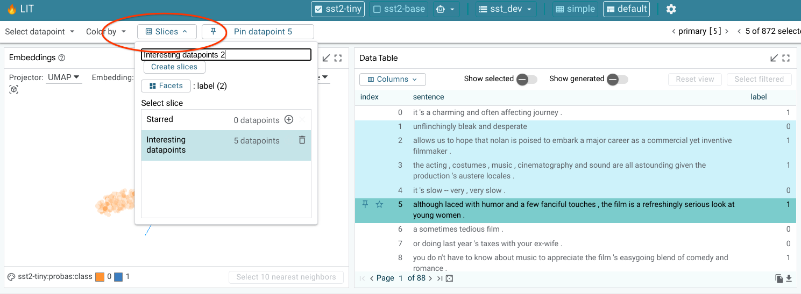

## URL Sharing

Many states of the LIT app, such as models and datasets loaded, datapoints
selected, and modules minimized, are all stored in URL parameters. In this way,
if a user wants to share the tool with a specific view set up with someone else,
they can copy the URL (either manually or via the share link button) as a means 
of sharing it.

The base url that will be copied with the share link button can be configured by 
passing the `--canonical_url=<url base>` flag to the server.

## Module Details

This section contains details on using and interacting with individual modules
that are built into LIT. Note that this list may not be complete and additional
modules can be created and used in LIT by clients.

All modules can be toggled to be shown full-screen through use of the
full-screen button in the top-right of each module.

### Embedding Projector

When using LIT with a model that returns embeddings (or activations), in
addition to predictions, the embedding projector will show all datapoints by
their embeddings projected down to 3 dimensions. This is useful for exploring
and understanding clusters of datapoints.

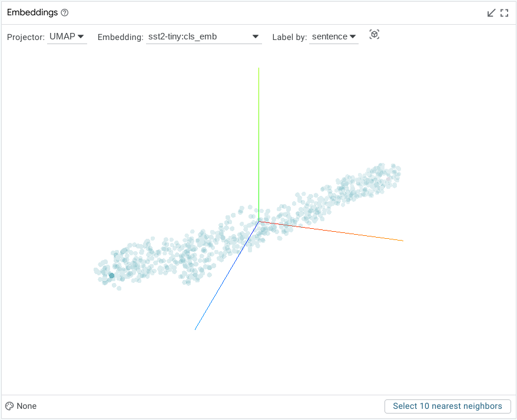<!-- DO NOT REMOVE {width="500"} -->

The specific embedding used to generate the projection can be selected in a
dropdown, along with the method of projection (either UMAP or PCA). An
additional drop-down allows changing of the datapoint feature used for the label
of each datapoint. The labels are shown on datapoint hover or click.

The visualization can be rotated through click-and-drag interaction, and panned
through control+click-and-drag. A datapoint can be selected with a click, or a
set of datapoints can be selected using a lasso through a shift+click-and-drag
interaction.

The color of that datapoints is controlled by the color settings in the
selection toolbar.

### Data Table

The data table shows all datapoints in a simple table. Datapoints can be
selected or unselected through a click. Shift+click allows selecting a set of
consecutive datapoints, and control+click allows selecting a set of individual
datapoints one at a time. Currently selected datapoints are highlighted with a
light blue background. The primary selected datapoint is highlighted with a
darker blue background. If a set of datapoints is currently selected, clicking
on a single datapoint in that set will change it to be the primary selected
datapoint without changing the overall set of selected datapoints.

The default sort order shows datapoints in the order they were loaded from the
dataset, but with newly-generated datapoints being placed directly below their
"source" datapoint, instead of at the end of the table.

The sort order can be changed to sort by columns through use of the up and down
arrows in the table header row. Additionally, the data table can be filtered
through a text search using the search buttons for each column in the table
header row. All columns that have filters set on them have their search button
outlined. Clicking the **"x"** button in the search box for a column will clear
that column's filter.

The **"show only selected"** checkbox toggles the data table to only show the
datapoints that are currently selected.

The **"reset view"** button returns the data table to its standard, default
view.

A **"columns"** drop-down allows showing/hiding of specific columns to customize
what the data table shows. Model predictions can be added as columns through
this dropdown, but they are not shown in the data table by default, in order to
keep the table decluttered.

The below data table shows one sorted by the "label" field, with the "passage"
field being filtered to only those datapoints that contain the word "sound" in
them.

A datapoint can be pinned to enable comparison by clicking the pin icon on the 
left side of the datapoint's table entry when the datapoint is hovered over or
selected. A pinned datapoint can be unpinned by clicking on its pin icon again.

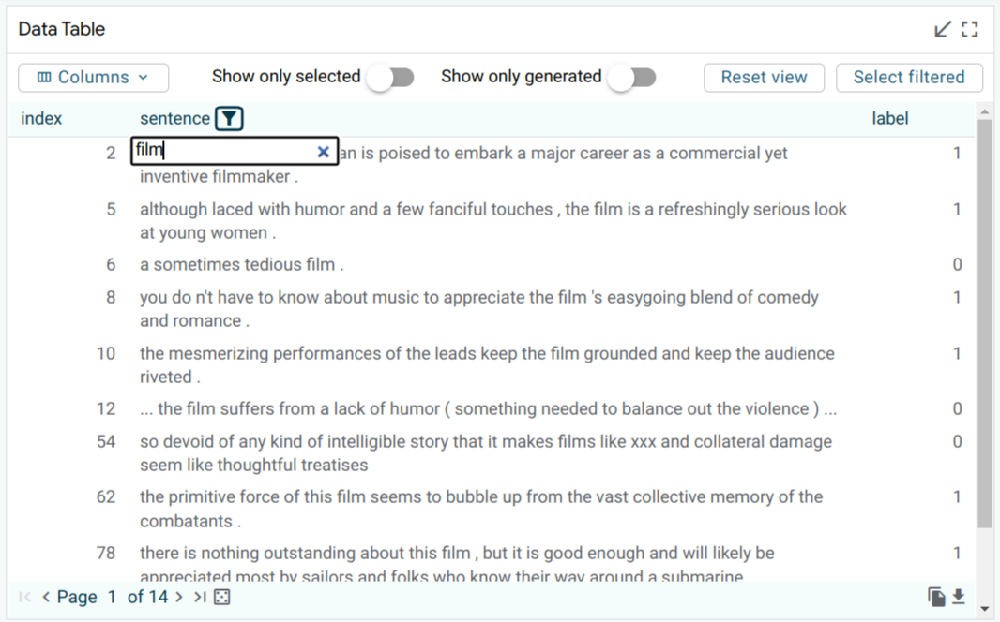<!-- DO NOT REMOVE {width="500"} -->

You can also export data to CSV using the copy or download buttons in the bottom
right:

<!-- DO NOT REMOVE {width="400"} -->

This will export all data in the current table view. To export only the
selection, use the "Show only selected" toggle. To include additional
columns such as model predictions, enable them from the "Columns" dropdown.

### Datapoint Editor

The datapoint editor shows the details of the primary selected datapoint, if one
is selected. Any field can be edited, and a new datapoint created with those
edits through the **"Make new datapoint"** button. Any edit to an existing
datapoint must be saved as a new datapoint to be explored, to keep datapoints
immutable for simplicity of use.

When no datapoint is selected, the editor shows a blank datapoint that can be
filled out by hand to create a completely new datapoint.

Features shown with a "(\*)" next to their name are required as model input and
must be filled out to create a new datapoint. Other fields are optional.

### Datapoint Generator

The datapoint generator module allows creation of new datapoints from all
currently-selected datapoints (or the entire dataset if no datapoints are
selected) through a set of counterfactual datapoint generators. These generators
are provided by the backend and all available generators will show up as buttons
in the module. Clicking one of these buttons causes the creation of new
datapoints that are displayed in a table inside the module and can be added to
the dataset either individually, or altogether, through the add buttons.

Generators built into LIT include:

*   **Scrambler**: Scrambles the words in a text feature randomly.
*   **Back-translation**: Translates a text feature into other languages and then
    back to the source language to create paraphrases of the initial text
    feature.
*   **Hotflip**: When analyzing a classification task and the model provides
    token-based gradients, this generator will change the token with the highest
    influence on the prediction to the token with the most opposite influence.
*   **Word replacer**: Provides a text box to define a comma-separated set of
    replacements to perform (such as "great -> terrible, hi -> hello").
    Counterfactual datapoints are created for any datapoint found that contains
    the source word, with it replaced with the provided result word. Word
    replacer also supports multiple targets per word with "|" separator. For
    example, "great -> terrible | bad" will produce two outputs where "great" is
    replaced with "terrible" and "bad".

The non-text fields in the generated datapoints can be edited before adding them
to the dataset. This is important in case some datapoint feature is no longer
correct after the counterfactual generation. For example, in a sentiment
classifier, if you used the word replacer generator to replace the word "good"
with "terrible" in the input "this movie is good", then you probably want to
change the ground truth sentiment of that datapoint from 1 to 0 before you add
it to your dataset for analysis.

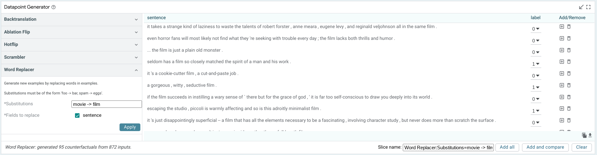

### Metrics Table

The metrics table shows model metrics for each model in a table format. The
exact metric types are determined by the python metrics component that
calculates metrics given the model types being evaluated. These can include
measures such as accuracy (for classifiers), error (for regression tasks), and
BLEU score (for translation tasks). By default, the measures are calculated and
shown for the entire dataset, and also for the current selection. Additionally,
through the **"show slices"** checkbox, the metrics table can calculate and
display metrics for each saved slice as well.

There is also a **"Facet by"** set of dataset feature checkboxes; one checkbox
for each feature in the dataset that results can be faceted by. When one or more
of these are checked, the dataset (or current selection, if there is one) is
faceted into sub groups for each of the calculated buckets, and metrics are
displayed for those subsets of the datapoints of interest. This could be used,
for example, to compare metrics for a toxicity classifier, broken down by
gender, assuming the dataset has a categorical gender feature in it.

The below screenshot shows the metrics table with metrics for the entire
dataset, for the dataset faceted into datapoints with label 0 and with label 1,
and also for two named slices that have been created by a user.

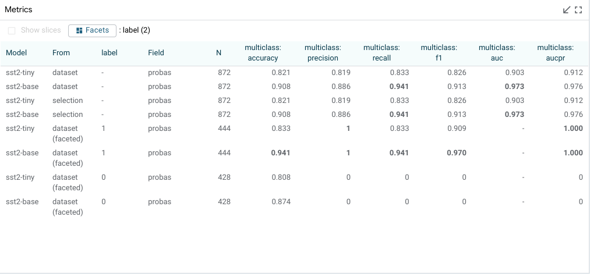

### Confusion Matrix

The confusion matrix buckets all datapoints from the dataset (or the current
selection, if one is made) into buckets in a 2D matrix. This is normally used to
compare classification predictions on a model versus the ground truth classes of
the datapoints. But, the axes of the matrix are configurable to be set to any
categorical field in the dataset or return from a model. So, when comparing two
models, the confusion matrix can be set up to show agreements/disagreements
between classifications in the two models, as opposed to
agreements/disagreements between one model's classifications and the ground
truth.

The individual cells, and the row and column headers, are all clickable to
toggle on/off selection of the datapoints in that cell or row or column. In this
way, the confusion matrix module can be used to select points of interest, such
as all false positives in a binary classification task, or all datapoints where
two models being compared disagree on classification.

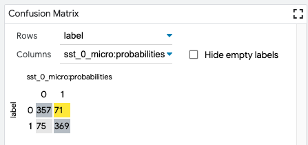

### Scalars

The scalars module shows a set of scatter or jitter plots, one for each
scalar output of a loaded model (such as a regression score, or a classification
score for a specific class). Each of them contains all datapoints in the
dataset, laid out horizontally by the score. For classification scores, the Y
axis is a random jitter of the data to better view all datapoints. For
regression scores, where ground truth is known, the Y axis is the error in the
prediction (points below the x-axis are under-predicted).

Datapoints can be selected either though clicking, or through lasso selection
through clicking and dragging.

The color of that datapoints is controlled by the color settings in the
selection toolbar.

For binary classification tasks, this module also contains a threshold slider in
order to change the positive classification threshold at which datapoints are
classified as being in the positive class. This slider value defaults to 0.5.

For multi-class classification tasks where a null index (default class) is set
in the model specifications, this module also contains a margin slider for the
non-default classes, to control how high a classification score must be in that
class before a datapoint is classified as that class as opposed to the default
class. The margin value defaults to 0, meaning the class with the highest score
is the class the datapoint is inferred to be.

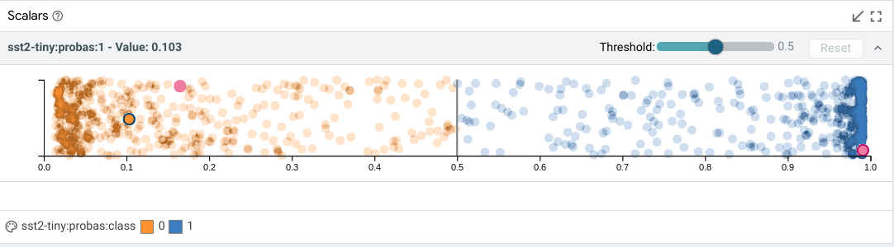

### Model Output

Model output modules show the result of a model on the primary selected
datapoint. The visuals of these modules depend on the model task being
performed. For a simple classification task, it will show the class scores from
the model, the predicted class, and, if ground truth is available in the
dataset, it will also show the ground truth classification.

For structured prediction tasks like span labeling, a span graph module can
display all tagged spans returned by the model, along with a visualization of
the ground truth spans if one is available in the dataset.

<!-- DO NOT REMOVE {width="800"} -->

### Salience Maps

Salience maps show the influence of different parts of inputs features on a
model's prediction on the primary selection. This module can contain multiple
methodologies for calculating this salience, depending on the capabilities of
the model being analyzed (e.x. if the model provides gradients, then
gradient-based token-wise salience can be calculated and displayed -- see
[adding models and data](api.md#adding-models-and-data) for more). The
background of each text piece is colored by the salience of that piece on the
prediction, and hovering on any piece will display the exact value calculated
for that piece.

There is an **"autorun"** button by each methodology. If it is checked, then
that calculation is made when a new primary datapoint is selected. If it is
unchecked, the calculation isn't made until it is checked. This can be valuable
so that expensive, long-running saliency calculations (such as LIME) aren't
performed on every datapoint selection, but only when explicitly asked for.

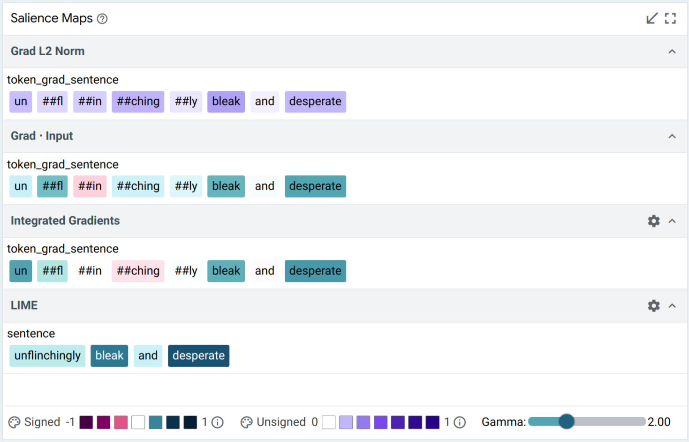

### Attention

For models that return attention head information along with predictions, the
attention module shows which tokens are attended to between layers of a model.
Dropdowns allow you to select which layer and attention head is being
visualized. Line opacity is controlled by the magnitude of the attention between
those tokens.

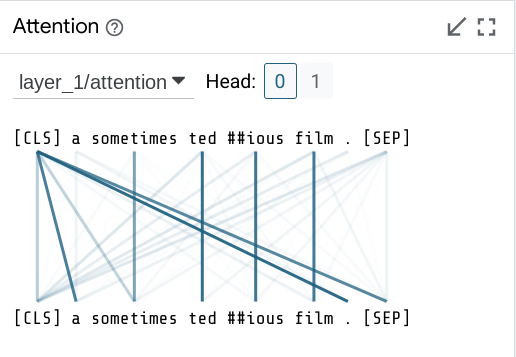

## User Journeys

In this section, we explore some example user journeys and how LIT enables them.

### Sentiment Analysis

How well does a sentiment classifier handle negation? We load the development
set of the Stanford Sentiment Treebank, and use the search function in LIT’s
data table to find the 56 datapoints containing the word “not”. Looking at the
*Metrics* Table, we find that surprisingly, our BERT model gets 100% of these
correct! But we might want to know if this is truly robust. With LIT, we can
select individual datapoints and look for explanations. For example, take the
negative review, “It’s not the ultimate depression-era gangster movie.”. As
shown in the screenshot below, salience maps suggest that “not” and “ultimate”
are important to the prediction.

We can verify this by creating modified inputs, using LIT’s *Datapoint Editor*.
Removing “not” gets a strongly positive prediction from “It’s the ultimate
depression-era gangster movie.”, while replacing “ultimate” to get “It’s not the
worst depression-era gangster movie.” elicits a mildly positive score from our
model.

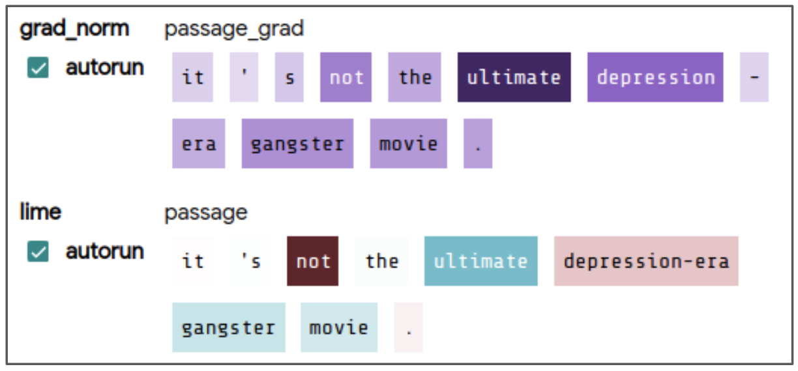

### Gender Bias in Coreference

Does a system encode gendered associations, which might lead to incorrect
predictions? We load a coreference model trained on OntoNotes, and load the
Winogender dataset into LIT for evaluation. Each Winogender example has a
pronoun and two candidate referents, one a occupation term like (“technician”)
and one is an “other participant” (like “customer”). Our model predicts 
coreference probabilities for each candidate. We can explore the model’s
sensitivity to pronouns by comparing two examples side-by-side (see structured
predictions in screenshot). We can see how commonly the model makes similar
errors by paging through the dataset, or by selecting specific slices of
interest.

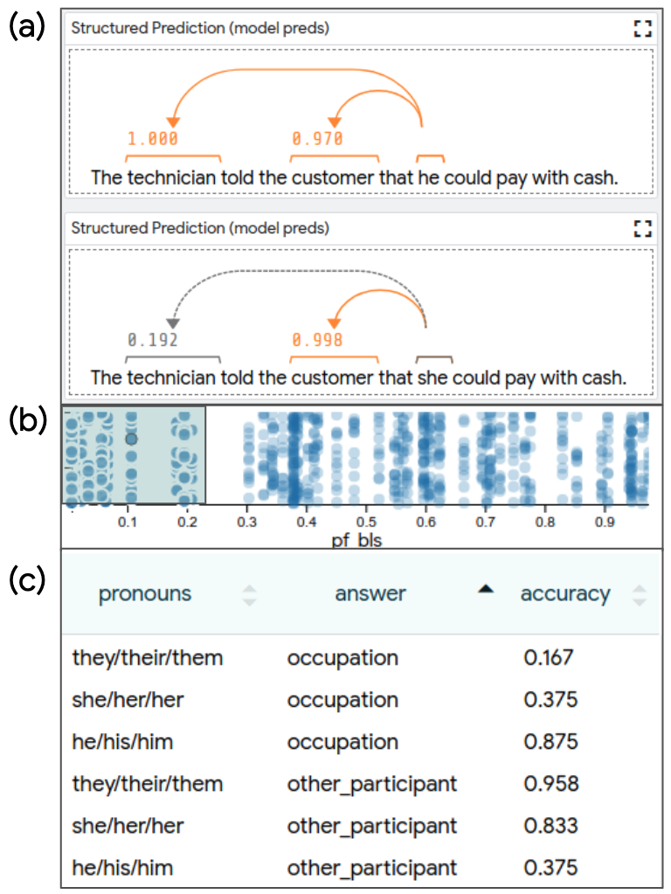

In the *Metrics* table, we can slice this selection by pronoun type and by the
true referent. On the set of male-dominated occupations (< 25% female by BLS),
we see the model performs well when the ground-truth agrees with the
stereotype - e.g. when the answer is the occupation term, male pronouns are
correctly resolved 83% of the time, compared to female pronouns only 37.5% of
the time (screenshot section (c)).

### Debugging Text Generation

<!-- TODO(lit-dev): T5 no longer makes the mistake documented below. Find a
     example that fits better with the text generation debugging story -->

Does the training data explain a particular error in text generation? We analyze
an older T5 model on the CNN-DM summarization task. LIT’s *Scalars* module
allows us to look at per-example ROUGE scores, and quickly select an example
with middling performance (screenshot section (a)). We find the generated text
(screenshot section (b)) contains an erroneous constituent: “alastair cook was
replaced as captain by former captain ...”. We can dig deeper, using LIT’s
language modeling module (screenshot section (c)) to see that the token “by” is
predicted with high probability (28.7%).

To find out how T5 arrived at this prediction, we utilize the “similarity
searcher” component through the datapoint generator (screenshot section (d)).
This performs a fast approximate nearest-neighbor lookup from a pre-built index
over the training corpus, using embeddings from the T5 decoder. With one click,
we can retrieve 25 nearest neighbors and add them to the LIT UI for inspection.
We see that the words “captain” and “former” appear 34 and 16 times in these
examples–along with 3 occurrences of “replaced by” (screenshot section (e)),
suggesting a strong prior toward our erroneous phrase.

<!-- DO NOT REMOVE {width="500"} -->
